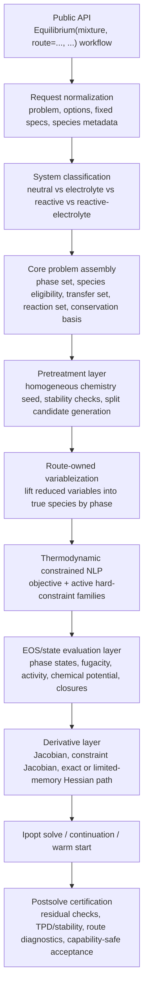
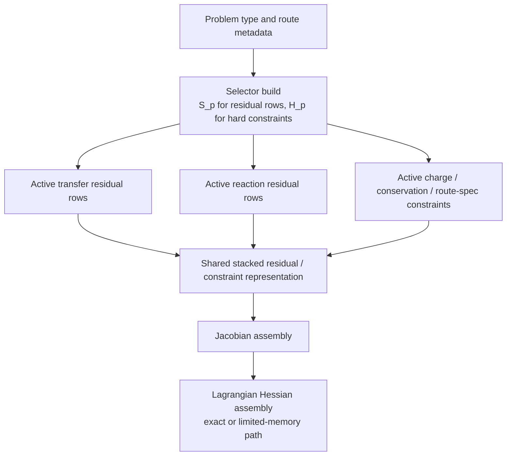
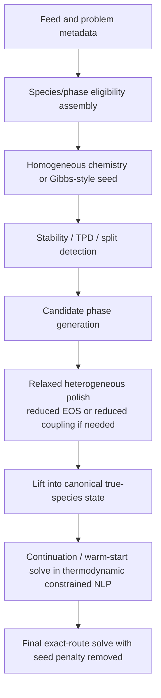
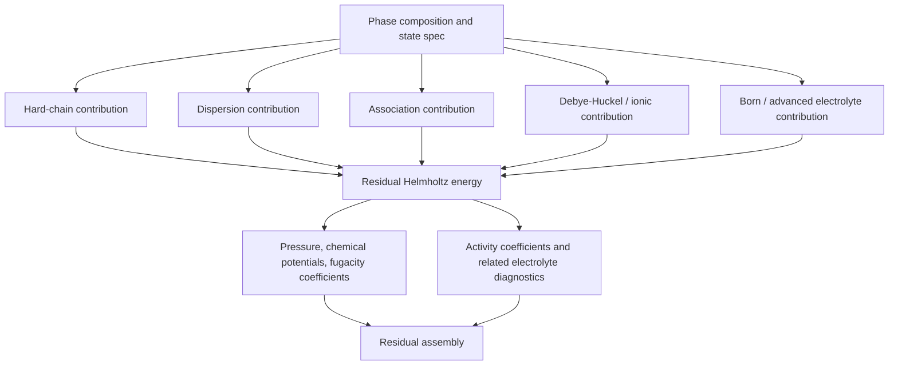

# Generalized Fluid-Phase Equilibrium

This is the canonical roadmap, mathematical doctrine, architecture contract,
and activation policy for generalized fluid-phase equilibrium in `ePC-SAFT`.
It consolidates the former architecture, mathematical algorithm, and activation
matrix roadmap documents into one source of truth.

`docs/roadmaps/equilibrium_benchmark_registry.yaml` remains the executable
registry for activation rows, proof cases, and evidence tiers. This document
explains the doctrine and policy; the YAML registry carries machine-checkable
row metadata.

## Current Capability Baseline And Source Hierarchy

The current production-exposed public selector routes remain neutral,
nonreactive, nonelectrolyte `bubble_pressure`, `bubble_temperature`,
`dew_pressure`, `dew_temperature`, `flash`, and neutral nonassociating `lle`.
Bubble and dew pressure/temperature routes are production utility routes in the
selector surface, but their generic `bubble_dew_derived_routes` key is excluded
from the generalized PE/CE/CPE activation matrices. Do not delete existing
bubble/dew code or tests when working on the generalized matrix.

The current generalized-matrix production baseline is narrower:

- PE-01 `neutral_tp_flash`;
- PE-03 `neutral_lle`;
- internal PE support rows used by those routes.

Stage 1A is complete for PE-01 and PE-03 with neutral HELD/TPD evidence. The
next neutral phase-equilibrium implementation target is Stage 1B: PE-04 neutral
multiphase flash. Associating, electrolyte, reactive, and combined
phase-chemical routes remain blocked until their own derivative, fixture,
certification, and capability gates pass.

Long-term strategic priority remains electrolyte LLE, reactive electrolyte LLE,
and speciation or chemical equilibrium with EOS activities. Immediate
implementation remains neutral PE-04 first because the shared phase-discovery
and postsolve-certification infrastructure is prerequisite evidence for later
more complex routes.

## Consolidation Rules Used Here

- Duplicate statements are deduplicated only where the same policy appeared in
  multiple source sections.
- Unique equations, matrices, route policies, evidence rules, and instructions
  are retained.
- Historical F1-F9 agent instructions are preserved in an appendix, but the
  live roadmap supersedes stale instructions that described already-completed
  PE-01 and PE-03 work as future work.
- No code route admission, public API behavior, native capability claim, or
  runtime support status changes because of this documentation consolidation.

## Architecture Contract

The architecture contract defines one coherent mathematical and algorithmic
structure that can cover homogeneous speciation and chemical equilibrium,
neutral VLE/LLE/flash routes, electrolyte LLE, reactive electrolyte LLE, later
bubble/dew and related phase-equilibrium routes, and shared pretreatment,
stability, continuation, diagnostics, and certification. The target remains a
single equilibrium core with route-owned variableizations and selectors, not a
family of disconnected solvers or compatibility modes.


### Cleanup contract

The active package architecture is:

- the public `Equilibrium(mixture, route=..., ...)` workflow object normalizes supported requests into one route contract;
- Ipopt route callbacks use explicit density or phase volume variables, while pressure-root density solves are limited to normal `State(T, P, x)` calls and seed construction;
- exact gradients and exact Jacobians are required for production routes, with exact Lagrangian Hessians as the default when a route is exposed as production native Ipopt;
- `limited-memory` Hessians are an explicit opt-out mode, not an automatic fallback from `auto`;
- route implementations declare variables, residual families, constraints, phase eligibility, and seed recipes, while shared modules own phase-state adapters, derivative carriers, Lagrangian assembly, Ipopt metadata, diagnostics, and result normalization;
- native route contract payloads should expose their active `variable_model`, `density_backend`, `residual_families`, and `constraint_families` directly rather than leaving that evidence implicit in ad hoc diagnostics strings;
- completed GoalBuddy boards, tranche handoffs, and audit reports are not source-of-truth package documentation once their current facts are captured here or in `FULL_ROADMAP.md`.

### Governing decisions

The core decisions fixed by this document are:

1. The final package equilibrium representation is an activation-selected
   thermodynamic constrained NLP. Residual objectives are allowed only as
   route-declared equation-solve, globalization, diagnostic, or certification
   forms.
2. Gibbs-style minimization remains useful as a provider-native objective,
   soft-start, feasibility, and globalization layer.
3. Canonical thermodynamic truth is true species by phase.
4. Reduced, transformed, apparent, or reaction-coordinate variables are allowed only as route-owned variableizations that lift into the canonical truth.
5. Pretreatment, stability testing, seed generation, and certification are shared infrastructure for all equilibrium families.
6. The core must support two first-class interphase equilibrium mechanisms in the same simultaneous problem:
   - direct transfer of the same species across phases,
   - cross-phase reaction equilibrium for extraction and complexation systems.
7. Phase-restricted species are first-class generic-core data, not route-specific hacks.
8. Exact gradients and exact Jacobians are required for production routes. Exact Lagrangian Hessians are the target whenever the active route has full derivative coverage.

### Priority alignment

The intended priority order is:

- Tier 1:
  - electrolyte LLE,
  - reactive electrolyte LLE,
  - speciation / chemical equilibrium with EOS activities.
- Tier 2:
  - generic VLE and TP flash,
  - neutral LLE.
- Tier 3:
  - electrolyte bubble and other less central routes,
  - VLLE and other secondary multiphase routes.

The architecture must still be general enough that Tier 2 and Tier 3 routes are reduced views of the same core rather than separate solver families.

### Current public entrypoint and selector boundary

The current repo exposes selector-backed neutral nonassociating production
routes through the constructor-configured workflow object. The selector core
sits beneath this interface:

- `Equilibrium(mixture, route="bubble_pressure", T=..., x=...).solve()`
- `Equilibrium(mixture, route="bubble_temperature", P=..., x=...).solve()`
- `Equilibrium(mixture, route="dew_pressure", T=..., y=...).solve()`
- `Equilibrium(mixture, route="dew_temperature", P=..., y=...).solve()`
- `Equilibrium(mixture, route="flash", T=..., P=..., z=...).solve()`
- `Equilibrium(mixture, route="lle", T=..., P=..., z=...).solve()`

The native selector metadata is authoritative for public route-family exposure.
`bubble_dew_derived_routes`, `neutral_tp_flash`, and `neutral_lle` are
production-exposed selector families for neutral, non-reactive,
non-electrolyte mixtures. The generalized PE/CE/CPE activation matrix is a
separate admission layer: it includes PE-01 `neutral_tp_flash` and PE-03
`neutral_lle`, but deliberately excludes the generic
`bubble_dew_derived_routes` utility key. The current `neutral_lle` proof is a
synthetic neutral nonassociating binary route with exact Ipopt callbacks and
activation-matrix certification. Electrolyte, reactive, and speciation
families remain declared-not-exposed future families and must not be advertised
as callable public routes until a selector-owned production implementation and
focused public tests exist.

The architecture below should therefore be read as a unifying backend contract
for future route families, not as a claim that those families are presently
available.

### Architecture preflight gate for route additions

Every equilibrium route addition must pass this gate before implementation
edits begin:

1. Prove the owner file for the closest production route. For neutral VLE, the
   owner is `src/epcsaft/native/equilibrium/routes/derived/bubble_dew.cpp`,
   reached through `src/epcsaft/native/equilibrium/core/selector_core.cpp`.
   New neutral VLE specs extend that core; they do not create a sibling
   production route family.
2. Write the route-spec matrix: route, knowns, unknowns, composition role,
   active residual rows, hard constraints, certification rows, activation key,
   and public entrypoint.
3. Add negative tests before implementation for direct pybind route exposure,
   Python dispatch around the selector, standalone flash/bubble/dew routes, and
   optimizer success without residual/certification acceptance.
4. Treat activation metadata as admission control. An activation key declares
   residual and constraint topology that the selector may expose after proof; it
   is not permission to invent an independent public route.
5. Get route-owner review before design lock when there are multiple plausible
   implementation paths.

If the owner file or route-spec matrix is ambiguous, stop and ask for
clarification before writing production code.

#### Current neutral production route-spec matrix

| Public route spec | Selector route | Knowns | Unknowns | Composition role | Activation key | Residual rows | Hard constraints | Certification |
| --- | --- | --- | --- | --- | --- | --- | --- | --- |
| `Equilibrium(mixture, route="bubble_pressure", T, x).solve()` | `bubble_pressure` | `T`, liquid `x` | `P`, vapor `y`, phase volumes | liquid | `bubble_dew_derived_routes` | fixed-composition, phase-pressure consistency, phase-equilibrium, phase-distance | fixed liquid composition, common pressure, phase volume gap | exact derivatives, density closure, fixed composition, material/phase totals, phase-equilibrium residual, noncollapsed split |
| `Equilibrium(mixture, route="bubble_temperature", P, x).solve()` | `bubble_temperature` | `P`, liquid `x` | `T`, vapor `y`, phase volumes | liquid | `bubble_dew_derived_routes` | fixed-composition, phase-pressure consistency, phase-equilibrium, phase-distance | fixed liquid composition, common pressure, phase volume gap | exact derivatives, density closure, fixed composition, material/phase totals, phase-equilibrium residual, noncollapsed split |
| `Equilibrium(mixture, route="dew_pressure", T, y).solve()` | `dew_pressure` | `T`, vapor `y` | `P`, liquid `x`, phase volumes | vapor | `bubble_dew_derived_routes` | fixed-composition, phase-pressure consistency, phase-equilibrium, phase-distance | fixed vapor composition, common pressure, phase volume gap | exact derivatives, density closure, fixed composition, material/phase totals, phase-equilibrium residual, noncollapsed split |
| `Equilibrium(mixture, route="dew_temperature", P, y).solve()` | `dew_temperature` | `P`, vapor `y` | `T`, liquid `x`, phase volumes | vapor | `bubble_dew_derived_routes` | fixed-composition, phase-pressure consistency, phase-equilibrium, phase-distance | fixed vapor composition, common pressure, phase volume gap | exact derivatives, density closure, fixed composition, material/phase totals, phase-equilibrium residual, noncollapsed split |
| `Equilibrium(mixture, route="flash", T, P, z).solve()` | `neutral_tp_flash` | `T`, `P`, feed `z` | liquid `x`, vapor `y`, phase amounts, phase volumes | feed | `neutral_tp_flash` | material-balance, phase-pressure consistency, phase-equilibrium, phase-distance | material balance, common pressure, phase volume gap | exact derivatives, density closure, material closure, phase-equilibrium residual, noncollapsed two-phase split |
| `Equilibrium(mixture, route="lle", T, P, z).solve()` | `neutral_lle` | `T`, `P`, feed `z` | liquid1 `x`, liquid2 `x`, phase amounts, phase volumes | feed | `neutral_lle` | material-balance, phase-pressure consistency, phase-equilibrium, phase-distance | material balance, common pressure, phase-distance anti-collapse gate | exact derivatives, density closure, material closure, phase-equilibrium residual, noncollapsed liquid-liquid split |

### End-to-end stack



### Shared sets, maps, and notation

Let:

- $\mathcal{A}$ be the active phase set.
- $\mathcal{I}$ be the global true-species set.
- $\mathcal{R}$ be the active reaction set.
- $\mathcal{B}$ be the conserved-basis rows.
- $\mathcal{T}$ be the transferable same-species interphase pairs.

Define the phase-eligibility mask

$$
M_{i\alpha} \in \{0,1\}, \qquad i \in \mathcal{I},\ \alpha \in \mathcal{A}
$$

with:

- $M_{i\alpha}=1$ if species $i$ is allowed in phase $\alpha$,
- $M_{i\alpha}=0$ if species $i$ is phase-restricted out of phase $\alpha$.

Examples:

- free aqueous ions in a hydrophobic organic phase: typically $M_{i,\mathrm{org}}=0$,
- extracted organic complexes such as `RLi` or `Li-TOP-[Tf2N]`: typically $M_{i,\mathrm{aq}}=0$,
- water or neutral cosolvents: often allowed in both phases.

Define the canonical true-species phase-mole tensor

$$
N = \{n_{i\alpha}\}_{i \in \mathcal{I},\ \alpha \in \mathcal{A}}
$$

as the canonical truth state.

The optimizer does not have to use $N$ directly. Each route may own a reduced variable vector $u$ and a lift map

$$
N = \mathcal{T}_{p}(u)
$$

where $p$ denotes the route family or problem type.

This is the core abstraction:

- canonical truth is always true species by phase,
- route efficiency comes from the lift map $\mathcal{T}_{p}$.

### Shared equilibrium mechanisms

The core must support both of the following in the same simultaneous problem.

#### 1. Direct transfer residuals

For species that exist in both phases and really are the same chemical species, equilibrium is enforced by direct chemical-potential equality:

$$
r_{i,\alpha\beta}^{\mathrm{tr}} = \mu_{i}^{(\alpha)} - \mu_{i}^{(\beta)} = 0
$$

Equivalent forms are:

$$
\ln f_{i}^{(\alpha)} - \ln f_{i}^{(\beta)} = 0
$$

or

$$
\ln a_{i}^{(\alpha)} - \ln a_{i}^{(\beta)} = 0
$$

when those are the more natural state functions for the route.

#### 2. Cross-phase reaction residuals

For extraction, complexation, or other cases where species identity changes across phases, equilibrium is enforced by reaction affinity:

$$
r_{\ell}^{\mathrm{rxn}} = \frac{1}{RT}\sum_{\alpha \in \mathcal{A}} \sum_{i \in \mathcal{I}} \nu_{\alpha i \ell} \mu_{i}^{(\alpha)} = 0
$$

which is equivalent to

$$
r_{\ell}^{\mathrm{rxn}} = \ln Q_{\ell} - \ln K_{\ell} = 0
$$

for reaction $\ell \in \mathcal{R}$.

This is essential for lithium-extraction systems where free aqueous ions and extracted organic complexes are not identical species.

### Shared hard-constraint families

The final equilibrium core should treat the following as hard constraints or structural lift constraints.

#### Conservation

Use a generic conserved-basis matrix $A_{\mathrm{cons}}$:

$$
c^{\mathrm{cons}}(N) = A_{\mathrm{cons}} \operatorname{vec}(N) - b = 0
$$

where:

- for nonreactive routes, $A_{\mathrm{cons}}$ may reduce to species balances,
- for reactive routes, $A_{\mathrm{cons}}$ should be an element or conserved-moiety basis.

#### Phase electroneutrality

For electrolyte phases:

$$
c_{\alpha}^{\mathrm{charge}}(N) = \sum_{i \in \mathcal{I}} z_i n_{i\alpha} = 0
$$

for each electrolyte phase $\alpha$.

#### Route specifications

These are route-owned equality constraints such as:

- fixed $T$,
- fixed $P$,
- bubble or dew scalar closure,
- split-fraction closure,
- stability trial normalization.

Abstractly:

$$
c^{\mathrm{spec}}_p(u; T, P, z, \ldots) = 0
$$

#### EOS and auxiliary closures

Each phase state may require auxiliary closure variables such as density, site fractions, dielectric state, or other hidden EOS state variables:

$$
q_{\alpha} = [\rho_{\alpha}, \theta_{\alpha}, \epsilon_{r,\alpha}, \ldots]
$$

with closure equations

$$
c_{\alpha}^{\mathrm{eos}}(q_{\alpha}, n_{\alpha}, T, P) = 0
$$

These are part of the mathematical problem even if the route chooses to eliminate them by implicit solves.

#### Phase eligibility and positivity

Whenever possible, phase restrictions should be enforced structurally through the route lift map and bounds:

$$
n_{i\alpha} = 0 \quad \text{if } M_{i\alpha}=0
$$

and

$$
n_{i\alpha} \ge 0 \quad \text{if } M_{i\alpha}=1
$$

This is preferred over soft penalties.

### Residual-family selector architecture

The route does not change the core equations. It changes which residual families and which hard-constraint families are active.

Let $\bar r(u)$ be the master equilibrium-residual stack and $\bar c(u)$ be the master hard-constraint stack. Let $S_p$ and $H_p$ be selector matrices or masks for problem type $p$:

$$
r_p(u) = S_p \bar r(u), \qquad c_p(u) = H_p \bar c(u)
$$

This is the formal mechanism for the "on/off flags" required by the design.

The selector is allowed to activate or deactivate:

- direct transfer rows,
- reaction rows,
- phase-charge rows,
- route-spec rows,
- split-specific rows,
- stability-trial rows,
- route-specific certification rows.



### Problem-family activation matrix

For the row-by-row PE/CE/CPE roadmap and proof-case inventory, see
`docs/roadmaps/generalized_fluid_phase_equilibrium.md`.
The table below is the native selector/problem-family view. Its bubble/dew row
documents existing derived utility support and must not be copied into the
generalized PE/CE/CPE matrices.

| Problem family | Direct transfer | Reaction equilibrium | Conservation basis | Phase charge | Split variables | Stability prelayer | Postsolve certification |
| --- | --- | --- | --- | --- | --- | --- | --- |
| Neutral TP flash | On | Off | Species | Off | On | `held_tpd_volume_composition` | `tpd_postsolve` |
| Neutral LLE | On | Off | Species | Off | On | `held_tpd_volume_composition` | `tpd_postsolve` |
| Electrolyte LLE | On for transferable species | Off unless chemistry is modeled | Species or salt/solvent lift with exact back-lift | On | On | On | On |
| Reactive speciation | Off | On | Element/moiety | On when ionic | Off | Optional | On |
| Reactive LLE | On for shared species | On | Element/moiety | Optional | On | On | On |
| Reactive electrolyte LLE | On for shared species | On, including cross-phase reactions | Element/moiety | On | On | On | On |
| Bubble/dew derived routes | On | Off unless reactive route is explicitly modeled | Species or element/moiety | Optional | Usually one phase amount removed by spec | On | On |

Notes:

- Long-term Tier 1 emphasis remains electrolyte LLE, reactive electrolyte LLE, and reactive speciation.
- Current production exposure is selector-dispatched neutral two-phase routes:
  bubble/dew pressure and temperature, neutral TP flash, and neutral
  nonassociating LLE.
- Native C++ activation metadata is owned by `src/epcsaft/native/equilibrium/core/activation_matrix.h`.
  The metadata declares all problem families, keeps unproven families declared-not-exposed, and marks only the trusted
  neutral Ipopt exact-Hessian routes as production-exposed. CMake owns native implementation through
  explicit source groups under `native/model`, `native/eos`, `native/autodiff`, `native/equilibrium`,
  `native/regression`, and `native/bindings`.

### Canonical optimization form

The final package representation is an activation-selected thermodynamic
constrained NLP:

$$
\min_{u} \ \Phi_p^{\mathrm{thermo}}(u)
$$

subject to

$$
c_p(u) = 0
$$

and

$$
\ell_p \le u \le u_p
$$

with objective

$$
\Phi_p^{\mathrm{thermo}}(u)
=
\frac{1}{RT^0}
\sum_{\alpha\in\mathcal{A}}
\left[
A_\alpha(T^0,V_\alpha,n_\alpha,q_\alpha)+P^0V_\alpha
\right]
$$

for fixed-`T`, fixed-`P` phase-split routes. If the provider supplies a Gibbs
surface directly, the route may instead use:

$$
\Phi_p^G(u)
=
\frac{1}{RT^0}
\sum_{\alpha\in\mathcal{A}}
G_\alpha(T^0,P^0,n_\alpha,q_\alpha)
$$

Hard constraints and certification rows carry the route-specific physical
conditions:

- direct transfer residuals,
- reaction residuals,
- material or conserved-basis balances,
- pressure closure,
- phase eligibility and charge constraints,
- internal-state closure where lifted,
- phase distinctness/noncollapse gates.

Residual least-squares objectives remain available as explicitly declared
equation-solve, globalization, seed-polishing, or diagnostic forms:

$$
\Phi_{\mathrm{res}}(u)
= \frac{1}{2}\left\|W_{r,p}\, r_p(u)\right\|_2^2 +
\frac{\eta_{\mathrm{seed}}}{2}\left\|W_s \left(u-u^{(0)}\right)\right\|_2^2.
$$

The seed-regularization term is only for globalization, continuation, or
early-stage polishing. In the final accepted thermodynamic phase-split solve,
it should be disabled unless the route documentation explicitly declares
otherwise:

$$
\eta_{\mathrm{seed}} = 0.
$$

This keeps the final accepted solution tied to the thermodynamic objective,
hard constraints, and postsolve residual/certification checks rather than seed
proximity or optimizer status alone.

### Why this form is preferred

This form is preferred because it:

- keeps the physical pass/fail conditions explicit,
- makes residual activation by problem type clean,
- supports exact Jacobians and exact Lagrangian Hessians,
- preserves route-owned variableizations,
- allows Gibbs-style or relaxed seeds without changing the final truth conditions,
- gives route diagnostics in physically interpretable blocks.

### Soft-start and globalization ladder

The final core is not expected to converge robustly from arbitrary seeds. Shared pretreatment is therefore a first-class part of the design.



The shared seed ladder should support:

- homogeneous chemistry soft starts,
- one-phase-to-two-phase split generation,
- route-owned transformed-coordinate seeds,
- warm starts across temperature, pressure, composition, or continuation steps,
- optional relaxed heterogeneous solves that preserve chemistry truth while simplifying numerics.

### Stability as shared infrastructure

Stability is not a special add-on only for VLE.

It is shared infrastructure for:

- deciding whether a split is needed,
- generating candidate daughter phases,
- rejecting metastable or false splits,
- protecting the final route against bad seeds,
- certifying accepted results.

The stability sublayer may use reduced trial-phase problems, but it must still consume the same EOS/state and derivative infrastructure as the main core.

Neutral phase discovery should follow the doctrine in
`docs/roadmaps/generalized_fluid_phase_equilibrium.md`: TPD or
volume-composition trial phases generate candidates, duplicate candidates are
removed, candidate phase fractions must satisfy mass balance, and accepted
multiphase results must be certified as a full phase set. Per-phase TPD checks
alone are not enough; certification must also rule out a missing
lower-free-energy candidate set under the route's phase-count policy.

### EOS/state evaluation contract

Every route ultimately depends on phase-state evaluations of the form:

$$
s_{\alpha} = \mathcal{E}_{\alpha}(T, P, n_{\alpha})
$$

where the phase-state payload must be rich enough to provide, at minimum:

- $a_{\alpha}^{\mathrm{res}}$,
- $P_{\alpha}$ or the pressure residual,
- $\mu_{i}^{(\alpha)}$,
- $\ln \phi_{i}^{(\alpha)}$,
- $\ln \gamma_{i}^{(\alpha)}$ when defined for the route,
- density closure information,
- dielectric and association auxiliaries where relevant.

The EOS contribution graph is:



### Required derivative tiers

Exact Hessians for the shared core require more than "objective Hessians" in isolation. They require the derivative stack all the way from EOS closures to the Hessian of the Lagrangian.

#### Tier 0: value layer

Return values only:

- $a^{\mathrm{res}}$,
- $P$,
- $\mu_i$,
- $\ln \phi_i$,
- $\ln \gamma_i$,
- density/closure residuals.

#### Tier 1: explicit first derivatives

Return exact first derivatives of the value layer with respect to the route variables or lifted phase-state variables.

Typical examples:

- $\partial \mu_i / \partial n_j$,
- $\partial \ln \phi_i / \partial n_j$,
- $\partial P / \partial \rho$,
- $\partial a^{\mathrm{res}} / \partial \rho$.

#### Tier 2: implicit closure sensitivities

If the EOS state uses hidden closure variables $q_{\alpha}$, they must expose exact first-order sensitivities via the implicit function theorem:

$$
\frac{\partial q_{\alpha}}{\partial u}
= -
\left(
\frac{\partial c_{\alpha}^{\mathrm{eos}}}{\partial q_{\alpha}}
\right)^{-1}
\frac{\partial c_{\alpha}^{\mathrm{eos}}}{\partial u}
$$

This is required for exact route Jacobians whenever density, association, dielectric, or other hidden closures move with the route variables.

#### Tier 3: exact residual Hessians

Exact Hessian mode requires second derivatives of active residual and active hard-constraint blocks after all lift maps and implicit closures are accounted for.

This may be supplied by:

- analytic second derivatives,
- CppAD differentiated residual assembly,
- analytic implicit-differentiation blocks,
- or mixed analytic plus CppAD plus implicit-differentiation paths.

The key requirement is route completeness, not a single derivation style.

### Jacobian and Hessian structure

The route Jacobians are:

$$
J_r(u) = \frac{\partial r_p}{\partial u},
\qquad
J_c(u) = \frac{\partial c_p}{\partial u}
$$

with the chain rule passing through:

- route variableization $u \mapsto N$,
- EOS hidden-state closure $N \mapsto q$,
- thermodynamic properties $(N,q) \mapsto \mu, \phi, \gamma, \ldots$,
- residual assembly.

The Lagrangian is:

$$
\mathcal{L}(u,\lambda,z_L,z_U)
= \Phi_p(u) + \lambda^{\top} c_p(u) + z_L^{\top}(u-\ell_p) + z_U^{\top}(u-u_p)
$$

For exact Hessian mode:

$$
\nabla_{uu}^{2}\mathcal{L}
= J_r^{\top} W_{r,p}^{\top} W_{r,p} J_r +
\sum_{k} \omega_k r_k \nabla_{uu}^{2} r_k +
\sum_{j} \lambda_j \nabla_{uu}^{2} c_j +
\eta_{\mathrm{seed}} W_s^{\top} W_s
$$

Interpretation:

- the first term is the Gauss-Newton block,
- the second term is residual-curvature correction,
- the third term is the hard-constraint curvature contribution,
- the fourth term is optional seed regularization.

This is why exact Hessians for the shared equilibrium core require the full derivative tier rather than isolated objective-Hessian support.

### Hessian modes

The equilibrium core should preserve three user-facing Hessian modes:

- `hessian_mode="exact"`
- `hessian_mode="limited-memory"`
- `hessian_mode="auto"`

Required behavior:

- `exact` must fail loudly if any active route block lacks second-derivative coverage.
- `limited-memory` may still require exact gradients and exact Jacobians.
- `auto` must select `exact` for production native Ipopt routes. If an active route lacks verified complete Hessian coverage, that is an implementation gap and the route must fail loudly rather than silently selecting a non-exact Hessian mode.

Every solve should report:

- `hessian_approximation`,
- `hessian_backend`,
- and enough route diagnostics to show which derivative tier was active.

### Route-owned variableizations

The shared core must not force one global public variableization.

Instead:

- canonical truth is true species by phase,
- public API remains problem-family oriented,
- each route may choose a numerically convenient variableization,
- every variableization must lift cleanly into the same canonical truth.

Examples:

- neutral flash: phase fractions plus phase compositions,
- electrolyte LLE: transformed salt/solvent basis that preserves electroneutrality while lifting back to true species,
- reactive speciation: reduced reaction or conserved-basis coordinates lifted into true species,
- reactive electrolyte LLE: route-owned transformed variables for initialization, but final truth still expressed in explicit true species by phase.

### Certification requirements

A solve is not accepted merely because the optimizer reports convergence.

Postsolve certification must check:

#### Active equilibrium residuals

$$
\delta_{\mathrm{tr}} = \|r^{\mathrm{tr}}\|_{\infty},
\qquad
\delta_{\mathrm{rxn}} = \|r^{\mathrm{rxn}}\|_{\infty}
$$

#### Hard constraints

$$
\delta_{\mathrm{cons}} = \|c^{\mathrm{cons}}\|_{\infty},
\qquad
\delta_{\mathrm{charge}} = \|c^{\mathrm{charge}}\|_{\infty},
\qquad
\delta_{\mathrm{spec}} = \|c^{\mathrm{spec}}\|_{\infty}
$$

#### Stability

Single-phase or final accepted phase states must pass the appropriate stability certificate, for example via a TPD-style criterion:

$$
\Delta g_{\min}^{\mathrm{TPD}} \ge -\tau_{\mathrm{TPD}}
$$

for a certified stable state, or a route-specific equivalent certification rule for accepted multiphase states.

#### Physical admissibility

Check:

- positivity,
- phase restrictions,
- acceptable density closure,
- acceptable hidden-state closure,
- no silently activated fallback route that changes the thermodynamic meaning.

### Pseudocode skeleton

```text
Equilibrium(mixture, route=..., ...).solve():
    normalize problem and options
    classify route family
    build phase set, species set, eligibility mask, reaction set, transferable set
    build conserved-basis operator
    generate seed with shared pretreatment ladder
    choose route-owned variableization and lift map
    assemble active residual selectors and hard-constraint selectors
    solve thermodynamic constrained NLP with continuation / warm start support
    if exact hessian requested:
        require complete second-derivative coverage
    certify residuals, constraints, and stability
    return structured result + diagnostics + continuation state
```

### What this document means for implementation planning

Any future implementation plan should preserve the following boundaries:

1. Do not build separate solver truth systems for electrolyte LLE, reactive electrolyte LLE, and speciation.
2. Do not treat Gibbs soft starts as a replacement for the final simultaneous residual core.
3. Do not hide phase restrictions or cross-phase reactions in route-specific ad hoc logic if they belong in the generic core contract.
4. Do not mark exact-Hessian support complete until the route provides the full derivative tier needed by the Lagrangian Hessian.
5. Do not let bubble/dew or other Tier 3 routes distort the Tier 1 design target.
6. Do not use pytest to validate whole papers or force many literature feed lines to converge. Pytest should prove generic API-to-native route wiring, exact derivative availability, diagnostics, and certification on trusted representative cases; full paper validation belongs in explicit analysis or benchmark scripts.

### Practical source links

This architecture is meant to align with the current repo vocabulary and current package direction documented in:

- `docs/pages/equilibrium_architecture.rst`
- `docs/roadmaps/FULL_ROADMAP.md`
- `docs/papers/md/convex_chemical_equilibrium.md`
- `docs/papers/md/Ascani - 2023 - Simultaneous Predictions of Chemical and Phase Equilibria in Systems with an Esterif.md`
- `docs/papers/md/Yu - 2024 - Highly efficient lithium extraction from magnesium-rich brines with ionic.md`
- `docs/papers/md/Rezaee et al. - 2026 - Thermodynamic modeling of lithium extraction from synthetic brine using deep eutectic solvents A PC.md`

### Summary

The intended final package architecture is:

- one shared equilibrium core,
- one shared thermodynamic constrained NLP representation,
- one shared derivative ladder from EOS values to exact Lagrangian Hessians,
- one shared pretreatment and certification layer,
- route-owned variableizations that all lift into the same true-species-by-phase state,
- problem-type selectors that turn residual and constraint families on and off without changing the underlying thermodynamic truth.


## Mathematical Doctrine


### Doctrine Statement

The package equilibrium engine is a model-agnostic, activation-selected
thermodynamic constrained optimization framework for fluid-phase equilibrium.
The thermodynamic model is a provider. The core owns variables, constraints,
phase discovery, route activation, NLP assembly, derivative contracts,
postsolve certification, and result classification.

Use
`docs/roadmaps/generalized_fluid_phase_equilibrium.md` as the
row-by-row companion for phase-only (`PE-*`), chemical-only (`CE-*`), and
combined phase-chemical (`CPE-*`) activation rows, proof examples, evidence
tiers, staged admission order, and current route status. Use
`docs/roadmaps/equilibrium_benchmark_registry.yaml` as the executable registry
for those row records.

Bubble and dew pressure/temperature routes are derived utility routes. They
remain implemented and tested through the existing selector surface, but their
generic route keys are excluded from the generalized PE/CE/CPE activation
matrices. Do not delete existing bubble/dew code or tests; only demote them in
the generalized roadmap.

For fixed-`T`, fixed-`P` phase-split routes, the default production objective is
the pressure-transformed Helmholtz energy

```math
\Phi_{TP}
=
\sum_{\alpha \in \mathcal{A}}
\left[
A_\alpha(T^0,V_\alpha,n_\alpha,q_\alpha)
+P^0V_\alpha
\right],
```

subject to exact hard constraints and bounds. When a provider supplies a Gibbs
energy surface directly at fixed `T,P`, the equivalent objective is

```math
\Phi_G
=
\sum_{\alpha \in \mathcal{A}}
G_\alpha(T^0,P^0,n_\alpha,q_\alpha).
```

The two forms are related by the Legendre transform

```math
G(T,P,n)=\min_V [A(T,V,n)+PV],
```

with stationarity condition

```math
\frac{\partial A}{\partial V}+P=0,
\qquad
P_{\mathrm{EOS}}=-\frac{\partial A}{\partial V}=P.
```

Residual least-squares objectives are allowed only as route-declared
globalization, initialization, equation-solve, diagnostic, or certification
forms. Production acceptance is never based on optimizer status alone.

### Scope

This doctrine covers neutral VLE, neutral LLE, neutral TP flash, neutral
multiphase flash, associating VLE/LLE, strong-electrolyte LLE/VLLE, reactive
speciation, reactive VLE/LLE, and reactive electrolyte LLE. First
implementations may restrict public route exposure to two phases while
preserving the general state and certification form.

The package boundary remains generic thermodynamics infrastructure:

- `Equilibrium(mixture, route=..., ...)`
- `State(...)`
- `ParameterSet(...)`
- `TargetDataset(...)`
- future generic `ReactionSet(...)`

Do not add application-specific package APIs for lithium extraction metrics,
MEA absorption metrics, solvent screening, distribution coefficients, column
metrics, or paper-specific workflows.

This document does not make solid-liquid equilibrium, precipitation, hydrate
formation, kinetic reactors, transport, column discretization, or guaranteed
finite-time global optimization production targets. Those require separate
phase models, route specs, and ADR-level admission.

### Thermodynamic Provider Interface

For each phase `\alpha`, with phase kind `k_\alpha`, temperature `T`, volume
`V_\alpha`, mole vector `n_\alpha`, and internal state `q_\alpha`, the provider
must expose a phase-state interface.

State definitions:

```math
N_\alpha=\sum_i n_{i\alpha},
\qquad
x_{i\alpha}=\frac{n_{i\alpha}}{N_\alpha},
\qquad
\rho_\alpha=\frac{N_\alpha}{V_\alpha}.
```

Accepted provider modes:

- Helmholtz mode: `T,V,n,q`
- Gibbs mode: `T,P,n,q`
- pressure-root state mode: `T,P,x`

Pressure-root state mode is allowed for normal property calls and seed
construction. Production Ipopt routes should prefer explicit `V_\alpha` or
`\rho_\alpha` variables so the derivative contract does not hide a density-root
iteration inside a callback.

For Helmholtz mode, the provider supplies

```math
A_\alpha=A(T,V_\alpha,n_\alpha,q_\alpha),
```

```math
P_\alpha
=
-\left(
\frac{\partial A_\alpha}{\partial V_\alpha}
\right)_{T,n_\alpha,q_\alpha},
```

and

```math
\mu_{i\alpha}
=
\left(
\frac{\partial A_\alpha}{\partial n_{i\alpha}}
\right)_{T,V_\alpha,n_{j\ne i,\alpha},q_\alpha},
```

after accounting for internal-state closure. For Gibbs mode, the provider
supplies

```math
G_\alpha=G(T,P,n_\alpha,q_\alpha),
\qquad
\mu_{i\alpha}
=
\left(
\frac{\partial G_\alpha}{\partial n_{i\alpha}}
\right)_{T,P,n_{j\ne i,\alpha},q_\alpha}.
```

Where meaningful, the provider also supplies `\ln \phi_i`, `\ln f_i`,
`\ln a_i`, and `\ln \gamma_i`.

Internal variables are denoted by `q_\alpha`. Examples include association site
fractions, density roots, dielectric states, ion-pairing variables, homogeneous
speciation extents, and activity-model reference-state variables. The provider
must expose closure residuals

```math
F_\alpha^q(q_\alpha;T,V_\alpha,n_\alpha,p)=0.
```

For production derivative support, internal variables must be differentiated by
implicit sensitivities or lifted as explicit NLP variables with exact
constraint derivatives. Direct differentiation through an iterative internal
solve is not a production derivative path.

First-order implicit sensitivity:

```math
q_u = -\left(F_q^q\right)^{-1}F_u^q.
```

Production Ipopt routes must provide objective value, objective gradient,
constraint values, constraint Jacobian, and exact Lagrangian Hessian unless the
route explicitly declares a nonproduction or diagnostic limited-memory mode.
The provider must distinguish domain errors, unsupported phase kinds,
unsupported derivative paths, internal-state nonconvergence, and missing
parameters from ordinary solver failure.

### Canonical State

Let

```math
\mathcal{I}=\{1,\ldots,C\}
```

be the true-species set, and let

```math
\mathcal{A}=\{1,\ldots,\pi\}
```

be the active fluid-phase set. The canonical truth state is true species by
phase:

```math
N=\{n_{i\alpha}\}_{i\in\mathcal{I},\alpha\in\mathcal{A}}.
```

Every route-owned reduced variableization must lift into this state:

```math
N=\mathcal{T}_p(u).
```

Examples:

- neutral flash: phase amounts plus phase volumes
- bubble pressure: unknown pressure, incipient phase composition/amounts, and
  phase volumes
- electrolyte LLE: neutral species plus electroneutral reduced ionic variables
  plus volumes
- reactive speciation: conserved-basis variables or reaction extents
- reactive electrolyte LLE: phase amounts, reaction extents, electroneutral
  reduced variables, and volumes

Composition and totals are

```math
N_\alpha=\sum_i n_{i\alpha},
\qquad
x_{i\alpha}=\frac{n_{i\alpha}}{N_\alpha},
\qquad
n_{i\alpha}\ge 0.
```

The phase-eligibility mask

```math
M_{i\alpha}\in\{0,1\}
```

is structural. If `M_{i\alpha}=0`, then `n_{i\alpha}=0`. Phase restrictions
must not be enforced only through soft penalties.

### Objective Doctrine

For fixed `T,P` flash, LLE, and VLLE, use the dimensionless form

```math
\Phi_{TP}
=
\frac{1}{RT^0}
\sum_{\alpha}
\left[
A_\alpha(T^0,V_\alpha,n_\alpha,q_\alpha)
+P^0V_\alpha
\right].
```

If Gibbs energy is the natural provider output:

```math
\Phi_G
=
\frac{1}{RT^0}
\sum_\alpha G_\alpha(T^0,P^0,n_\alpha,q_\alpha).
```

Bubble/dew routes are route-specific reductions. They may use a thermodynamic
objective with hard route constraints, a square residual system that is
explicitly documented as the mathematical route formulation, or a hybrid with
thermodynamic objective plus residual certification. The project default is:
use the thermodynamic objective when phase amounts and volumes are active
variables, and use fugacity/chemical-potential residuals as hard constraints or
certification rows.

Residual objective form:

```math
\Phi_{\mathrm{res}}(u)
=
\frac{1}{2}\|W_r r_p(u)\|_2^2
+\frac{\eta_s}{2}\|W_s(u-u^{(0)})\|_2^2.
```

Allowed uses are seed polishing, homogeneous speciation solves, globalization,
diagnostic comparisons, and route formulations that explicitly declare equation
solving as the production mathematics. Do not silently replace the
thermodynamic objective for phase-split production routes, and do not accept a
result merely because a residual least-squares objective is small. Final
production phase-split solves should set `\eta_s=0` unless the route
documentation explicitly states otherwise.

### Constraint Doctrine

Nonreactive material balance:

```math
c_i^{\mathrm{mat}}(N)
=
\sum_\alpha n_{i\alpha}-n_i^F=0.
```

Reactive element or moiety balance:

```math
c^{\mathrm{cons}}(N)
=
A_{\mathrm{cons}}\operatorname{vec}(N)-b=0.
```

The conserved-basis matrix must be rank-reduced before production use.

Bounds:

```math
n_{i\alpha}\ge 0,
\qquad
N_\alpha>0,
\qquad
V_\alpha>0.
```

Trace-species lower bounds or log-variable transforms must be reported because
they affect certification.

For fixed pressure:

```math
c_\alpha^P
=
P_{\mathrm{EOS},\alpha}(T,V_\alpha,n_\alpha,q_\alpha)-P^0=0.
```

For unknown common pressure:

```math
c_{\alpha\beta}^P=P_\alpha-P_\beta=0.
```

Route specifications such as fixed `T`, fixed `P`, fixed feed `z`, fixed
liquid composition for bubble routes, fixed vapor composition for dew routes,
unknown scalar pressure, unknown scalar temperature, phase labels, and
phase-count caps are hard constraints or fixed variables.

Electrolyte phases must satisfy phase electroneutrality:

```math
z^T n_\alpha=0.
```

Strong-electrolyte production routes should enforce electroneutrality
structurally through reduced variables where possible.

For reaction `r`, with stoichiometric coefficients `\nu_{i\alpha r}`, reaction
affinity is

```math
\mathcal{A}_r
=
\sum_{\alpha,i}\nu_{i\alpha r}\mu_{i\alpha}.
```

The dimensionless reaction residual is

```math
c_r^{\mathrm{rxn}}
=
\frac{\mathcal{A}_r}{RT}=0.
```

If standard-state reaction constants are explicit, use

```math
c_r^{\mathrm{rxn}}
=
\ln Q_r-\ln K_r(T,P)=0.
```

For activity-based homogeneous reactions:

```math
\ln Q_r
=
\sum_i \nu_{ir}\ln(x_i\gamma_i).
```

If association site fractions are lifted, add exact mass-action constraints:

```math
F_a(X;T,\rho,x,p)
=
X_a
\left(
1+\rho\sum_b w_bX_b\Delta_{ab}
\right)-1=0.
```

Lifted internal-state constraints must provide exact Jacobian and Hessian rows.

A phase-distance constraint may be used as an anti-collapse gate:

```math
d_{\alpha\beta}
=
\|x_\alpha-x_\beta\|_\infty
\ge \tau_{\mathrm{split}}.
```

This is not a thermodynamic equilibrium equation. It is a route-specific
noncollapse, candidate-distinctness, or certification device and must be
labeled as such.

### KKT Mapping

For neutral nonreactive fixed `T,P` equilibrium in Gibbs form:

```math
\min_{\{n_{i\alpha}\}}
\sum_\alpha G_\alpha(T,P,n_\alpha)
```

subject to

```math
\sum_\alpha n_{i\alpha}=n_i^F.
```

The Lagrangian is

```math
\mathcal{L}
=
\sum_\alpha G_\alpha
+\sum_i\lambda_i
\left(n_i^F-\sum_\alpha n_{i\alpha}\right).
```

Stationarity gives

```math
\mu_{i\alpha}-\lambda_i=0,
```

so transferable species satisfy

```math
\mu_{i\alpha}=\mu_{i\beta}
\qquad
\forall i,\alpha,\beta,
```

or equivalently

```math
\ln f_{i\alpha}-\ln f_{i\beta}=0.
```

For Helmholtz form, stationarity with respect to `V_\alpha` gives mechanical
equilibrium:

```math
P_\alpha=P^0
```

for pressure-specified routes, or `P_\alpha=P_\beta` for unknown common
pressure.

For electrolyte routes, never compare raw ionic chemical potentials across
phases as if ions were neutral species. Use reduced electrochemical
potentials, charge-projected chemical-potential differences, mean ionic
combinations, or a route-owned electroneutral transformed basis.

If a charged reference species `r` is eliminated,

```math
n_{r\alpha}
=
-\sum_{i\ne r}\frac{z_i}{z_r}n_{i\alpha},
```

the reduced electrochemical potential is

```math
\mu_{i\alpha}^{el}
=
\mu_{i\alpha}
-\frac{z_i}{z_r}\mu_{r\alpha}.
```

The charged-species equilibrium residual is

```math
r_i^{el,\alpha\beta}
=
\mu_{i\alpha}^{el}-\mu_{i\beta}^{el}.
```

For reactions, the KKT condition is zero reaction affinity or the documented
standard-state form `\ln Q_r-\ln K_r=0`.

### Neutral HELD/TPD Phase Discovery

The phase-discovery layer is shared infrastructure, not a public route. It
must detect instability, generate candidate daughter phases, estimate phase
count, rank candidate phase sets, build Ipopt initial variables, certify
accepted results, and identify metastable or unstable phase sets.

HELD-style discovery reduces dependence on user-supplied phase guesses. It does
not remove the need for deterministic seeds, multistart or candidate search,
continuation, candidate ranking, and postsolve stability certification.

For a reference phase `z` at `T,P`, define dimensionless chemical potentials

```math
\hat{\mu}_i(z)=\frac{\mu_i(T,P,z)}{RT}.
```

For trial composition `w`, with `\sum_i w_i=1`,

```math
\mathrm{TPD}(w;z)
=
\sum_i w_i
\left[
\hat{\mu}_i(w)-\hat{\mu}_i(z)
\right].
```

A phase is stable if

```math
\min_{w\in\Delta}\mathrm{TPD}(w;z)
\ge -\tau_{\mathrm{TPD}}.
```

If the minimum is less than `-\tau_{\mathrm{TPD}}`, the minimizing `w` is a
candidate daughter phase.

For EOS models, a volume-composition trial problem avoids pressure-root
fragility. Let `v` be molar volume and `a(T,v,w)` be molar Helmholtz energy.
Define

```math
h(T,P^0,w,v)=a(T,v,w)+P^0v.
```

A supporting-plane trial problem may be written as

```math
\Theta(w,v;\lambda)
=
\frac{h(T,P^0,w,v)}{RT}
-\lambda_0
-\sum_{i=1}^{C-1}\lambda_iw_i,
```

with bounds on `w` and `v`. Candidate phases are minimizers that lie on or
below the current supporting plane.

Deterministic seed hierarchy:

1. previous continuation state
2. HELD/TPD negative-minimum candidates
3. pure-component and near-pure-component trial points
4. deterministic composition lattice
5. Wilson/K-value or volatility-based VLE guesses where meaningful
6. shifted-feed liquid-liquid guesses
7. binary extreme guesses
8. route-specific backup seed generators

Do not call backup seed generation a production fallback solver.

Candidate phases `p` and `q` are duplicates if

```math
\|x^{(p)}-x^{(q)}\|_\infty<\tau_x
```

and

```math
|\ln v^{(p)}-\ln v^{(q)}|<\tau_v.
```

Keep the candidate with lower transformed free energy and better domain
diagnostics.

Given candidate compositions `x^{(k)}`, solve phase-fraction feasibility:

```math
\sum_k\beta_k x_i^{(k)}=z_i,
\qquad
\sum_k\beta_k=1,
\qquad
\beta_k\ge 0.
```

If the mass-balance residual

```math
\delta_{\mathrm{mb,cand}}=\|X\beta-z\|_\infty
```

does not pass, phase discovery is incomplete.

For a multiphase result, certification must check at least:

1. each accepted phase is locally stable against an additional phase;
2. the accepted phases share the correct common tangent or supporting
   hyperplane;
3. the candidate set is mass-balance complete and no lower-free-energy phase set
   has been found.

Current implementation work should start with two-phase neutral flash/LLE and
keep the general algorithm documented for later multiphase routes. Until full
HELD/TPD discovery exists, results should label the discovery backend as
`deterministic_seed_sweep` and stability certification as `not_available` or
`postsolve_local_only`. Once available, accepted production results should
report `phase_discovery_backend = "held_tpd_volume_composition"` and
`stability_certificate = "tpd_postsolve"`.

### Electrolyte Extension

Strong electrolytes are represented as true dissociated ions unless a route
explicitly declares an apparent salt variableization and exact back-lift.
Every electrolyte phase and every electrolyte trial phase must satisfy
electroneutrality:

```math
z^Tn_\alpha=0.
```

Do not run neutral TPD over unconstrained ionic composition space.

Ascani-style cation-anion pair variables use charge-balanced increments. For a
cation `c` and anion `a`,

```math
z_c\Delta n_{c\alpha}+z_a\Delta n_{a\alpha}=0.
```

Stacking independent pair and neutral variables gives

```math
n_\alpha=B_{\mathrm{pair}}s_\alpha,
\qquad
z^Tn_\alpha=0.
```

This is useful for mixed salts, common ions, and mean ionic residuals.

Perdomo-style reduced electroneutral coordinates eliminate one charged
reference species `r`:

```math
n_{r\alpha}
=
-\sum_{i\ne r}\frac{z_i}{z_r}n_{i\alpha}.
```

The constrained phase free energy is

```math
G_\alpha^{el}(T,P,n_\alpha^{(r)})
=
G_\alpha(T,P,n_\alpha(n_\alpha^{(r)})).
```

The reduced electrochemical potentials are

```math
\mu_{i\alpha}^{el}
=
\mu_{i\alpha}
-\frac{z_i}{z_r}\mu_{r\alpha}.
```

Use this when formal strong-electrolyte TPD and HELD2.0-style phase discovery
are primary. In composition space, the independent electrolyte TPD domain is

```math
\Omega^{el}
=
\{x\ge0:\sum_i x_i=1,\ z^Tx=0\}.
```

For `C` true species, the reduced composition domain has `C-2` independent
coordinates after the mole-fraction sum and electroneutrality constraints. A
reduced mole-number formulation has `C-1` degrees of freedom after
electroneutrality. HELD2.0 dual-variable counts depend on the exact primal
form, so do not universalize the `C-2` composition count into every
electrolyte TPD implementation.

Using reduced coordinates `y`,

```math
\mathrm{TPD}^{el}(y;y^0)
=
g^{el}(y)-g^{el}(y^0)
-\nabla g^{el}(y^0)^T(y-y^0),
```

with stability condition

```math
\min_{y\in\Omega^{el}}\mathrm{TPD}^{el}(y;y^0)
\ge -\tau_{\mathrm{TPD}}.
```

Do not assume ions are absent from vapor or organic phases unless phase
eligibility says so. Allowed strategies include log mole-number variables,
positive lower floors with reported tolerances, charge-neutral paired
perturbations, and reduced-coordinate bounds from electroneutrality.

For salt `m` with cation `c`, anion `a`, and stoichiometric coefficients
`\nu_c,\nu_a`, a mean ionic chemical-potential combination is

```math
\mu_{\pm,m,\alpha}
=
\frac{\nu_c\mu_{c\alpha}+\nu_a\mu_{a\alpha}}
{\nu_c+\nu_a}.
```

Mean ionic residuals are useful for pair formulations but do not replace full
reduced electrochemical certification when multiple independent ions and common
ions are present.

### Reactive Extension

Reactive systems use true species unless a route explicitly declares an
apparent variableization with exact lift to true species. Let `E` be the
element or moiety matrix:

```math
E\in\mathbb{R}^{B\times C}.
```

The conserved inventory is

```math
b=En^F,
```

and multiphase reactive equilibrium requires

```math
\sum_\alpha En_\alpha=b.
```

Two variableizations are allowed:

- nonstoichiometric: variables are true species `n_{i\alpha}` with conserved
  element/moiety balances and reaction-affinity stationarity;
- stoichiometric: variables are extents `\xi_r`, with exact lift from feed to
  true species.

For phase-transfer reactions and extraction complexes, the framework must
support both same-species transfer residuals and cross-phase reaction residuals
in the same problem. Identical neutral species present in both phases use
chemical-potential or fugacity equality. Species that transform across phases
use reaction affinity rows.

Ascani 2023 is a useful reactive neutral CPE/LLE reference. It is not a
complete reactive-electrolyte LLE framework and must not be cited as proof that
reactive electrolyte equilibrium is solved.

### Association Extension

Exact PC-SAFT association remains the thermodynamic reference. With flattened
association site `a`, site weight `w_b`, and association strength
`\Delta_{ab}`,

```math
X_a
=
\frac{1}
{1+\rho\sum_b w_bX_b\Delta_{ab}}.
```

Residual form:

```math
F_a(X;T,\rho,x,p)
=
X_a
\left(
1+\rho\sum_b w_bX_b\Delta_{ab}
\right)-1=0.
```

Association Helmholtz contribution:

```math
a^{\mathrm{assoc}}
=
\sum_i x_i\sum_{A\in i}\nu_{iA}
\left(
\ln X_{iA}
-\frac{X_{iA}}{2}
+\frac{1}{2}
\right).
```

Production option A is eliminated exact association: solve `F(X)=0` inside the
provider and use implicit sensitivities. Required diagnostics include
`association_model = "implicit_exact"`, sensitivity backend, solve convergence,
mass-action residual norm, and site count.

Production option B is lifted exact association: include `X_{a\alpha}` in
Ipopt variables and add exact mass-action constraints. The lifted route must
provide exact Jacobian rows, exact Hessian rows, association objective Hessian
terms, site-component ownership metadata, and association-delta dependency
contracts.

Nonproduction option C is explicit approximate association:

```math
X_a \approx X_a^{\mathrm{approx}}(T,\rho,x,p),
\qquad
a^{\mathrm{assoc,approx}}=a^{\mathrm{assoc}}(X^{\mathrm{approx}}).
```

Allowed uses are seed generation, phase-discovery acceleration, continuation,
diagnostic comparison, and explicit experimental routes that are labeled
approximate. Required metadata:

```text
association_model = "explicit_approx"
association_closure = "<closure_name>"
derivative_backend = "cppad_explicit"
exact_derivative_of = "approximate_association_closure"
production_thermodynamic_model = false
```

Never report explicit approximate association as exact PC-SAFT association
unless the closure satisfies mass action at the same tolerance as the exact
solve.

Associating LLE is blocked until all of these pass:

1. neutral HELD/TPD phase discovery and full phase-set stability certification;
2. exact associating EOS values and derivatives;
3. at least one narrow one-associating-component `bubble_pressure` proof;
4. at least one additional associating VLE proof;
5. explicit approximate closures labeled as approximate diagnostics only.

### Activation Matrix Doctrine

The activation matrix is admission control, not a wish list. Each row should
declare:

- key and display name
- public routes
- production exposure and exposure status
- knowns and unknowns
- phase-count policy and phase kinds
- species-eligibility policy
- variable model and objective family
- density backend
- internal-state strategy
- phase-discovery backend and seed generators
- residual families
- constraint families
- certification families
- derivative requirement
- proof routes and benchmark evidence
- negative tests

Route-family defaults:

| Family | Objective | Variables | Discovery | Required certification |
| --- | --- | --- | --- | --- |
| `neutral_tp_flash` | `A+PV` | phase amounts plus volumes | `held_tpd_volume_composition` for the current two-phase route | material, pressure, fugacity, `tpd_postsolve`, noncollapse |
| `neutral_lle` | `A+PV` | phase amounts plus volumes | `held_tpd_volume_composition` for the current neutral nonassociating two-liquid route | material, pressure, fugacity, `tpd_postsolve`, phase distance |
| `electrolyte_lle` | constrained `A+PV` or `G^{el}` | electroneutral reduced variables plus volumes | electrolyte TPD | material, charge, reduced electrochemical potentials, TPD |
| `reactive_speciation` | `G` or residual stationarity | true species or extents | optional homogeneous stability | element balance, reaction affinity |
| `reactive_lle` | `A+PV` or `G` | true species by phase plus extents if used | reactive TPD | element, pressure, transfer, reaction, TPD |
| `reactive_electrolyte_lle` | constrained `A+PV` or `G^{el}` | true species, electroneutral reduced variables, reaction variables | electrolyte/reactive TPD | element, charge, reduced electrochemical, reaction, TPD |

Derived bubble/dew utility routes keep their existing route-specific
documentation and tests outside this defaults table. A future fixed-composition
VLE proof may support a generalized matrix row, but the row must name the
underlying phase-equilibrium family rather than the generic bubble/dew utility
key.

A route may be production-exposed only if the native route exists, the public
API reaches it through the selector, activation metadata matches route
diagnostics, exact gradient and Jacobian exist, exact Hessian exists or the
route is explicitly nonproduction, postsolve certification passes, stability
certification is implemented or the route is labeled not globally certified,
proof tests pass, negative tests prevent accidental broadening, and
capabilities do not overclaim.

### Final Ipopt Solve

For two-phase neutral flash/LLE:

```math
u=
[n_{1,1},\ldots,n_{C,1},V_1,
 n_{1,2},\ldots,n_{C,2},V_2].
```

For `p` phases, repeat the phase amount and volume block for each phase.
Additional variables may include `T`, `P`, reaction extents, association
fractions, reduced electrolyte variables, and phase fractions.

The standard NLP form is

```math
\min_u \Phi_p(u)
```

subject to

```math
c_p(u)=0,
\qquad
g_p(u)\ge0,
\qquad
\ell_p\le u\le u_p^U.
```

Recommended dimensionless scaling:

- amounts: `n_i/N_feed`
- volumes: `V/(N_feed/rho_ref)`
- objective: `Phi/(RTN_feed)`
- chemical potentials: `mu/(RT)`
- pressure residual: `(P_EOS-P)/max(P,P_ref)`
- reaction residual: affinity divided by `RT`
- charge residual: `z^Tn/N_feed`
- association residual: raw dimensionless mass-action residual

Bounds must be route-specific and reported. For trace electrolytes, prefer log
variables or electroneutral pair variables over arbitrary independent tiny mole
lower bounds.

Warm-start metadata must include seed name, seed source, phase-discovery
backend, continuation stage, and internal-state strategy. Production Ipopt
routes must report exact gradient, exact Jacobian, exact Hessian, Hessian
backend, `eval_h` calls, derivative backend, and implicit sensitivity backend
where relevant.

### Postsolve Certification

Optimizer success is not acceptance. A production result must certify:

Conservation:

```math
\delta_{\mathrm{cons}}
=
\|A_{\mathrm{cons}}\operatorname{vec}(N)-b\|_\infty.
```

Nonreactive material balance:

```math
\delta_{\mathrm{mat}}
=
\left\|\sum_\alpha n_\alpha-n^F\right\|_\infty.
```

Pressure:

```math
\delta_P
=
\max_\alpha
\left|
\frac{P_\alpha-P^0}{P_{\mathrm{scale}}}
\right|.
```

Neutral fugacity:

```math
\delta_f
=
\max_{i,\alpha,\beta}
|\ln f_{i\alpha}-\ln f_{i\beta}|.
```

Electrolyte charge:

```math
\delta_z
=
\max_\alpha
\left|
\frac{z^Tn_\alpha}{N_\alpha}
\right|.
```

Reduced electrochemical residual:

```math
\delta_\mu^{el}
=
\max_{i,\alpha,\beta}
\left|
\left(
\frac{\mu_{i\alpha}}{RT}
-\frac{z_i}{z_r}\frac{\mu_{r\alpha}}{RT}
\right)
-
\left(
\frac{\mu_{i\beta}}{RT}
-\frac{z_i}{z_r}\frac{\mu_{r\beta}}{RT}
\right)
\right|.
```

Reaction residual:

```math
\delta_{\mathrm{rxn}}
=
\max_r
\left|
\sum_{\alpha,i}
\nu_{i\alpha r}
\frac{\mu_{i\alpha}}{RT}
-\ln K_r
\right|.
```

If `K_r` is embedded in standard chemical potentials, omit the explicit
`\ln K_r` term and document the convention.

TPD stability:

```math
\delta_{\mathrm{TPD},\alpha}
=
\min_w \mathrm{TPD}(w;x_\alpha).
```

Stable requires

```math
\delta_{\mathrm{TPD},\alpha}\ge -\tau_{\mathrm{TPD}}.
```

Electrolyte phases use the reduced electrolyte TPD over `\Omega^{el}`.

Phase distinctness:

```math
d_{\alpha\beta}
=
\max_i |x_{i\alpha}-x_{i\beta}|.
```

Association internal-state residual:

```math
\delta_X=\|F(X)\|_\infty.
```

Production results must include accepted flag, status, rejection reason,
objective, constraint norms, postsolve norms, phase labels, phase amounts,
phase compositions, phase volumes, phase densities, derivative metadata, phase
discovery metadata, stability metadata, and association/electrolyte/reaction
diagnostics when applicable.

### Result Status Taxonomy

Use exact status semantics:

- `production_accepted`: finite solver output, hard constraints pass,
  postsolve residuals pass, stability certification passes, phase distinctness
  passes, derivative contract satisfied, route is production-exposed, and no
  diagnostic-only model was used in the final accepted solve.
- `optimizer_converged_uncertified`: Ipopt converged, but at least one
  certification block is missing or was not run.
- `postsolve_rejected`: finite point returned, but one or more residuals failed.
- `unstable`: local residuals pass, but a negative TPD candidate remains.
- `metastable`: local KKT/residuals pass, but a lower-free-energy candidate
  phase set is found.
- `approximate_diagnostic_only`: final solve used an approximate thermodynamic
  model such as `explicit_approx` association.
- `blocked_missing_derivative`: exact derivative coverage required by the route
  is missing.
- `blocked_not_exposed`: activation row exists, but production exposure is
  false.
- `failed_domain`: thermodynamic provider left its valid domain.
- `failed_solver`: optimizer failed and no finite certifiable candidate was
  produced.

### Staged Implementation Roadmap

Stage 0: activation-matrix and schema documentation.

- Keep this doctrine, the activation-matrix companion, the unified core
  roadmap, and the master roadmap synchronized.
- Record row IDs, route-family status, proof cases, derivative requirements,
  and non-admission rules before broadening solver math.

Stage 1: neutral HELD/TPD phase discovery and full phase-set certification.

- Current baseline: PE-01 `neutral_tp_flash` and PE-03 `neutral_lle` report
  `held_tpd_volume_composition` and `tpd_postsolve`.
- Keep the route scope neutral, nonelectrolyte, nonreactive, and
  nonassociating for `neutral_lle`.
- The remaining neutral expansion is PE-04 neutral multicomponent/multiphase
  discovery, not associating or electrolyte LLE.
- Do not add new public routes merely because Stage 1 metadata exists.

Stage 2: standalone chemical equilibrium.

- Start with CE-01 ideal homogeneous CE.
- Add CE-04 nonstoichiometric element CE.
- Add CE-05 activity-based speciation.
- Add CE-13 reaction-constant convention conversion.

Stage 3: neutral combined phase-chemical equilibrium.

- Add CPE-01 neutral reactive VLE flash only after CE proof rows exist.
- Add CPE-03 neutral reactive LLE only after phase-set certification and CE
  proofs are both active.
- Treat Ascani 2023 as a neutral reactive CPE/LLE reference, not as a general
  reactive-electrolyte algorithm proof.

Stage 4: associating VLE.

- Prove exact associating EOS values and derivatives first.
- Keep explicit association closures diagnostic or approximate unless they are
  proven to match the mass-action solution.
- Admit only PE-10 neutral, nonelectrolyte, nonreactive `bubble_pressure` with
  at most one associating component and exact Hessian evidence.
- Add PE-11 as a second one-associating-component isothermal VLE proof before
  any associating LLE work.

Stage 5: strong-electrolyte LLE.

- Implement true-ion species, phase electroneutrality, Ascani pair variables,
  Perdomo reduced-coordinate TPD, distributed ions, and trace-ion handling.
- PE-15, PE-16, and PE-17 remain blocked until reduced electrolyte TPD and
  phase-set certification are proven.

Stage 6: electrolyte chemical equilibrium.

- Add CE-07 electrolyte speciation.
- Add CE-10 salt dissociation.
- Reuse CE-13 convention conversion so ionic equilibrium constants are never
  implicit.

Stage 7: reactive electrolyte combined equilibrium.

- Combine electrolyte reduced variables, phase electroneutrality, reaction
  affinities, cross-phase reactions, true species by phase, and HELD/TPD
  discovery.
- Target CPE-09, CPE-10, CPE-12, and CPE-14 only after the prerequisite PE and
  CE rows have proof evidence.

Stage 8: generalized multiphase electrolyte/reactive flash.

- Integrate the mature PE, CE, and CPE rows into generalized multiphase route
  selection.
- Turn source-backed benchmarks into executable tests or scripts with
  tolerances. Inventories alone are not benchmark completion.

### Full-Flow Pseudocode

```text
solve_equilibrium(request):
    normalize public request
    classify system:
        neutral / electrolyte / reactive / reactive-electrolyte
        associating / nonassociating
        phase-restricted / unrestricted
    load activation row for requested route
    require production exposure for public production solve
    build species metadata:
        true species
        charges
        phase eligibility mask
        component or element matrix
        reaction set
        transferable species set
        internal-state requirements
    build route spec:
        knowns
        unknowns
        phase kinds
        route scalar variables
        objective family
        constraint families
        certification families
    build route-owned variableization:
        choose u
        define lift N = T_p(u)
        define volume or density variables
        define reduced electrolyte coordinates if needed
        define extents or true-species variables if reactive
        define internal-state strategy
    run pretreatment:
        validate feed and domain
        homogeneous speciation seed if reactive
        density/property seeds
        association internal-state seeds if needed
    run phase discovery:
        if backend is held_tpd_volume_composition:
            run TPD / volume-composition trial problems
            collect candidate phases
            de-duplicate candidates
            solve candidate mass-balance selection
            rank candidate sets
        else:
            run declared route seed generators
    for candidate_set in ranked_candidate_sets:
        assemble Ipopt NLP:
            objective Phi_p(u)
            constraints c_p(u)
            inequalities g_p(u)
            bounds
            scaling
            exact derivative callbacks
        solve with Ipopt from candidate_set initial variables
        if solver returns finite point:
            lift variables to canonical true species by phase
            evaluate thermodynamic phase states
            run postsolve certification:
                conservation
                pressure
                fugacity or chemical potential
                charge and reduced electrochemical residual if electrolyte
                reaction affinity if reactive
                internal-state residual
                phase distinctness
                TPD stability
                candidate completeness
            if all certification passes:
                return production_accepted result
            record rejected attempt
    if approximate diagnostic continuation exists:
        run diagnostic route
        return approximate_diagnostic_only if it converges
    return best failed or rejected result with full diagnostics
```

### LaTeX-Ready Core Block

```tex
\section{Generalized Fluid-Phase Equilibrium Formulation}
Let $\mathcal{I}=\{1,\ldots,C\}$ denote the true-species set and
$\mathcal{A}=\{1,\ldots,\pi\}$ denote the active fluid-phase set.
The canonical thermodynamic state is the true-species phase-mole tensor
\[
N=\{n_{i\alpha}\}_{i\in\mathcal{I},\alpha\in\mathcal{A}}.
\]
For phase $\alpha$,
\[
N_\alpha=\sum_i n_{i\alpha},
\qquad
x_{i\alpha}=\frac{n_{i\alpha}}{N_\alpha},
\qquad
\rho_\alpha=\frac{N_\alpha}{V_\alpha}.
\]
For pressure-specified phase-split routes, the default thermodynamic objective is
\[
\Phi_{TP}
=
\sum_{\alpha\in\mathcal{A}}
\left[
A_\alpha(T,V_\alpha,n_\alpha,q_\alpha)+P^0V_\alpha
\right].
\]
The equivalent Gibbs formulation is
\[
\Phi_G
=
\sum_{\alpha\in\mathcal{A}}G_\alpha(T,P^0,n_\alpha,q_\alpha),
\qquad
G(T,P,n)=\min_V[A(T,V,n)+PV].
\]
Stationarity with respect to $V_\alpha$ gives
\[
\frac{\partial A_\alpha}{\partial V_\alpha}+P^0=0,
\qquad
P_\alpha=-\frac{\partial A_\alpha}{\partial V_\alpha}=P^0.
\]
For a nonreactive neutral mixture,
\[
\sum_{\alpha}n_{i\alpha}=n_i^F.
\]
The Gibbs-form Lagrangian is
\[
\mathcal{L}
=
\sum_\alpha G_\alpha
+
\sum_i \lambda_i
\left(n_i^F-\sum_\alpha n_{i\alpha}\right).
\]
Stationarity gives
\[
\mu_{i\alpha}=\lambda_i,
\qquad
\mu_{i\alpha}=\mu_{i\beta}.
\]
For electrolyte phases,
\[
z^T n_\alpha=0.
\]
If a charged reference species $r$ is eliminated,
\[
n_{r\alpha}=-\sum_{i\neq r}\frac{z_i}{z_r}n_{i\alpha},
\qquad
\mu_{i\alpha}^{el}
=
\mu_{i\alpha}-\frac{z_i}{z_r}\mu_{r\alpha}.
\]
The charged-species phase-equilibrium residual is
\[
r_i^{el,\alpha\beta}
=
\mu_{i\alpha}^{el}-\mu_{i\beta}^{el}.
\]
For reaction $r$,
\[
r_r^{rxn}
=
\sum_{\alpha,i}\nu_{i\alpha r}\frac{\mu_{i\alpha}}{RT}
-\ln K_r(T,P)=0.
\]
For neutral phase stability,
\[
\mathrm{TPD}(w;z)
=
\sum_i w_i
\left[
\frac{\mu_i(T,P,w)}{RT}
-
\frac{\mu_i(T,P,z)}{RT}
\right],
\qquad
\min_{w\in\Delta}\mathrm{TPD}(w;z)\ge -\tau_{\mathrm{TPD}}.
\]
For strong-electrolyte stability, trial compositions satisfy
\[
x\ge0,
\qquad
\sum_i x_i=1,
\qquad
z^Tx=0.
\]
Using reduced electrolyte coordinates $y$,
\[
\mathrm{TPD}^{el}(y;y^0)
=
g^{el}(y)-g^{el}(y^0)-\nabla g^{el}(y^0)^T(y-y^0),
\qquad
\min_{y\in\Omega^{el}}\mathrm{TPD}^{el}(y;y^0)\ge -\tau_{\mathrm{TPD}}.
\]
For exact association,
\[
F_a(X;T,\rho,x,p)
=
X_a\left(1+\rho\sum_b w_bX_b\Delta_{ab}\right)-1=0,
\qquad
X_u=-F_X^{-1}F_u.
\]
Explicit approximate closures may define
\[
X_a\approx X_a^{approx}(T,\rho,x,p),
\]
but the resulting derivatives are exact only for the approximate association
model, not for the exact mass-action PC-SAFT association model.
```

### Local References

- `docs/roadmaps/generalized_fluid_phase_equilibrium.md`
- `docs/roadmaps/generalized_fluid_phase_equilibrium.md`
- `docs/roadmaps/FULL_ROADMAP.md`
- `docs/roadmaps/gross2002_associating_vle_redo_plan.md`
- `docs/roadmaps/explicit_association_closure_for_pcsaft.md`
- `docs/latex/algorithms.tex`
- `docs/papers/md/Pereira et al. - 2012 - The HELD algorithm for multicomponent, multiphase equilibrium calculations with generic equations of.md`
- `docs/papers/md/Ascani, Sadowski, Held - 2022 - Calculation of Multiphase Equilibria Containing Mixed Solvents and M.md`
- `docs/papers/md/Perdomo et al. - 2025 - Phase stability criteria and fluid-phase equilibria in strong-electrolyte systems.md`
- `docs/papers/md/Ascani - 2023 - Simultaneous Predictions of Chemical and Phase Equilibria in Systems with an Esterif.md`


## Activation Matrix And Admission Doctrine


### Purpose

This document is the row-by-row activation companion to
`docs/roadmaps/generalized_fluid_phase_equilibrium.md`. The
algorithm doctrine defines the mathematical form. This matrix defines the
admission rows, proof examples, sequencing gates, and documentation checks that
keep implementation from silently broadening into unsupported phase, chemical,
associating, electrolyte, or reactive routes.

The generalized matrices are not route menus. They are activation records for
three problem families:

- phase-only equilibrium (`PE-*`);
- chemical-only equilibrium (`CE-*`);
- combined phase-chemical equilibrium (`CPE-*`).

Bubble and dew pressure/temperature routes are derived utility routes. They
remain implemented and tested through the existing selector/core route surface,
but the generic `bubble_dew_derived_routes` key is deliberately excluded from
the generalized PE/CE/CPE matrices. Do not delete existing bubble/dew code or
tests; demote them only in the generalized roadmap. A future row may use a
fixed-composition VLE proof case, but the matrix row must name the underlying
equilibrium family rather than admitting a generic bubble/dew route key.

The executable registry for this document is
`docs/roadmaps/equilibrium_benchmark_registry.yaml`.

### Current Baseline

The current production-exposed public selector routes remain:

- neutral, nonreactive, nonelectrolyte `bubble_pressure`,
  `bubble_temperature`, `dew_pressure`, and `dew_temperature`;
- neutral, nonreactive, nonelectrolyte `flash` through `neutral_tp_flash`;
- neutral, nonreactive, nonelectrolyte, nonassociating `lle` through
  `neutral_lle`.

The current Stage 1 generalized-matrix baseline is narrower:

- PE-01 `neutral_tp_flash`;
- PE-03 `neutral_lle`;
- internal PE support rows used by those routes.

Those routes must report:

```text
phase_discovery_backend = "held_tpd_volume_composition"
stability_certificate = "tpd_postsolve"
```

This does not expose associating LLE, electrolyte LLE, reactive LLE, reactive
electrolyte LLE, or generalized multiphase flash.

### Activation Status Vocabulary

| Status | Meaning |
| --- | --- |
| `production_exposed` | Public route selection is allowed and backed by exact derivative, postsolve certification, and executable proof evidence. |
| `diagnostic_only` | The row records internal infrastructure, diagnostics, or helper capability; it must not return `production_accepted` by itself. |
| `planned_not_public` | The row is part of the roadmap but is not reachable through public route selection. |
| `blocked_not_implemented` | The row is explicitly blocked until named proof, derivative, fixture, and capability gates pass. |
| `source_data_needed` | The row or benchmark has a source-backed target but no executable local fixture yet. |

### Benchmark Evidence Tiers

| Tier | Meaning |
| --- | --- |
| `T0` | Documented design or source inventory only; not executable production evidence. |
| `T1` | Executable package fixture or contract test with deterministic acceptance checks. |
| `T2` | Source-backed digitized or tabulated reference data with tolerances. |
| `T3` | Reproducible literature curve/table workflow with recorded artifacts and tolerances. |

No row may be `production_exposed` unless at least one proof case is `T1` or
higher, the proof fixture is available, exact derivatives are declared, and
postsolve certification checks are named.

### Canonical Activation-Record Schema

The registry records the staged version of the richer activation record that a
future native metadata surface can mirror:

```text
key
category
route_family
exposure
activation_status
production_exposed
phase_kinds
phase_count_policy
species_basis_policy
knowns
primary_variables
optional_variables
variable_model
objective_family
hard_constraints
optional_constraints
residual_blocks
phase_discovery_backend
seed_generators
stability_checks
certification_families
thermo_provider_contract
derivative_contract
internal_state_policy
proof_cases
required_evidence
forbidden_shortcuts
```

This stage keeps the native `ProblemFamilyActivation` struct intact and adds
the richer documentation/registry records first. That preserves the existing
native selector behavior while making the generalized matrix testable.

### Phase-Equilibrium Matrix

Each phase-equilibrium row carries at least one proof example and evidence
tier in `equilibrium_benchmark_registry.yaml`.

| Row | Family key | Scope | Required discovery/certification | First proof case | Current status |
| --- | --- | --- | --- | --- | --- |
| PE-01 | `neutral_tp_flash` | Neutral, nonreactive, nonelectrolyte two-phase TP flash | `held_tpd_volume_composition` plus `tpd_postsolve`; material balance, common pressure, common fugacity, noncollapse, full phase-set stability | Hydrocarbon methane/ethane/propane case in `tests/support/hydrocarbon_cases.py` | `production_exposed` |
| PE-02 | `neutral_two_phase_vle_tp` | Neutral, nonreactive, nonelectrolyte two-phase VLE at fixed `T,P` | Same PE-01 discovery/certification without fixed-composition route reduction | Hydrocarbon VLE fixture after PE-01 remains green | `planned_not_public` |
| PE-03 | `neutral_lle` | Neutral, nonreactive, nonelectrolyte, nonassociating two-liquid split | `held_tpd_volume_composition` plus `tpd_postsolve`; material balance, common pressure, common fugacity, phase-distance anti-collapse, full phase-set stability | Synthetic nonideal binary in `tests/support/equilibrium_cases.py` | `production_exposed` |
| PE-04 | `neutral_multiphase_nonassoc` | Neutral nonassociating LLLE/VLLE or more-than-two-phase discovery | HELD/TPD candidate generation generalized beyond two selected phases; mass-balance-complete phase-set certification | Internal ternary or source-backed literature case after PE-01/PE-03 remain green | `planned_not_public` |
| PE-05 | `neutral_vle_multicomponent` | Neutral multicomponent VLE beyond current hydrocarbon proof envelope | PE-01 discovery/certification retained; broader benchmark coverage | Additional hydrocarbon or PC-SAFT paper fixture | `planned_not_public` |
| PE-06 | `neutral_single_phase_stability` | Single feed stability check without route solve | Neutral TPD over simplex; no raw route acceptance from optimizer status | Hydrocarbon feed stable/unstable pair | `planned_not_public` |
| PE-07 | `neutral_split_seed_generation` | Deterministic seed and candidate ranking layer | Seed inventory, de-duplication, rank diagnostics, phase-set completeness metrics | Shared with PE-01/PE-03/PE-04 | `diagnostic_only` |
| PE-08 | `neutral_density_closure` | EOS density/volume solve for phase candidates | Exact density closure diagnostics and domain failure reporting | Existing native EOS density checks | `diagnostic_only` |
| PE-09 | `neutral_property_certification` | Residual-property consistency at accepted phase states | Exact state/property diagnostics; no separate route admission | Existing state/property checks | `diagnostic_only` |
| PE-10 | `associating_vle_one_assoc_fixed_liquid_pressure` | Neutral, nonelectrolyte, nonreactive VLE proof with at most one associating component | Exact associating EOS derivatives, association mass-action diagnostics, route-local postsolve certification; no global associating LLE claim | Gross/Sadowski 2002 Figure 2 methanol/isobutane, `T = 373.15 K`, `k_ij = 0.05` | `blocked_not_implemented` |
| PE-11 | `associating_isothermal_vle_one_assoc` | Additional isothermal associating VLE proof | Same as PE-10, plus a second source-backed Gross/Sadowski case | Gross/Sadowski 2002 1-pentanol/benzene or 1-propanol/benzene | `blocked_not_implemented` |
| PE-12 | `associating_lle` | Neutral associating liquid-liquid split | PE-04-style full phase discovery plus exact associating EOS derivatives plus PE-10/PE-11 VLE evidence | Methanol/cyclohexane only after VLE gates; water/alcohol later | `blocked_not_implemented` |
| PE-13 | `associating_temperature_condition_vle` | Associating VLE with solved temperature condition | Temperature-variable route proof with exact derivative and association diagnostics | Gross/Sadowski isobaric VLE after PE-10/PE-11 | `blocked_not_implemented` |
| PE-14 | `cross_associating_vle` | More than one associating component or cross-association route | Full association-matrix diagnostics and exact derivative proof | Source-backed alcohol/alcohol or water/alcohol case | `planned_not_public` |
| PE-15 | `electrolyte_lle_salt_solvent` | Strong-electrolyte LLE with salt/solvent lift | Phase electroneutrality, reduced variables, electrolyte TPD, distributed-ion policy | Ascani/Sadowski/Held 2022 mixed-solvent electrolyte case | `source_data_needed` |
| PE-16 | `electrolyte_lle_trace_ion` | Electrolyte LLE with trace-ion handling | Reduced-coordinate bounds, charge-neutral perturbations, reported floors and tolerances | Ascani 2022 trace-ion variant | `source_data_needed` |
| PE-17 | `electrolyte_vlle` | Strong-electrolyte vapor-liquid-liquid equilibrium | Electrolyte HELD/TPD with all eligible phases considered | Ascani 2022 or Held electrolyte benchmark | `source_data_needed` |
| PE-18 | `electrolyte_tpd_reduced_composition` | Formal electrolyte TPD in reduced composition coordinates | Composition domain has `C-2` independent coordinates after sum and electroneutrality constraints | Perdomo/HELD2.0-style reduced TPD case | `planned_not_public` |
| PE-19 | `electrolyte_tpd_reduced_moles` | Formal electrolyte TPD in reduced mole-number coordinates | Reduced mole-number space has `C-1` degrees of freedom after electroneutrality; dual counts depend on primal form | Perdomo-style reduced mole-number case | `planned_not_public` |
| PE-20 | `phase_distance_anti_collapse` | Nontriviality gate for candidate distinctness | Used only to prevent duplicate phases; never treated as thermodynamic equilibrium proof | Existing neutral LLE/flash noncollapse diagnostics | `diagnostic_only` |
| PE-21 | `supporting_plane_phase_set` | Common-tangent/supporting-plane certification | Full phase-set stability, not just per-phase TPD | Shared postsolve certificate | `diagnostic_only` |
| PE-22 | `phase_candidate_mass_balance` | Candidate-set completeness | Candidate phase set must be able to reconstruct the feed within tolerance | Shared HELD/TPD diagnostics | `diagnostic_only` |
| PE-23 | `generalized_multiphase_flash` | General neutral/electrolyte/reactive multiphase flash | All active constraints, reduced variables, reactions, and phase-set certification | Deferred until PE/CE/CPE rows mature | `planned_not_public` |

### Chemical-Equilibrium Matrix

Chemical-equilibrium rows do not imply phase splitting. They own reaction
sets, conservation bases, reaction-constant conventions, and homogeneous
stability checks.

| Row | Family key | Scope | Required proof | Current status |
| --- | --- | --- | --- | --- |
| CE-01 | `ideal_homogeneous_reaction` | Ideal homogeneous reaction at fixed `T,P` | Closed-form or high-precision synthetic equilibrium | `planned_not_public` |
| CE-02 | `stoichiometric_extent_ce` | Extent-variable homogeneous CE | Element/moiety balance and reaction affinity residuals | `planned_not_public` |
| CE-03 | `true_species_ce` | True-species mole variables without phase split | Element matrix rank, positivity, affinity stationarity | `planned_not_public` |
| CE-04 | `nonstoichiometric_element_ce` | Gibbs minimization with elemental conservation | Element basis, rank handling, no dependent reaction requirement | `planned_not_public` |
| CE-05 | `activity_based_speciation` | Nonideal liquid speciation with activity coefficients | Activity/standard-state convention test | `planned_not_public` |
| CE-06 | `acid_base_speciation` | Acid/base reactions and charged species | Charge balance, element balance, pH convention proof | `planned_not_public` |
| CE-07 | `electrolyte_speciation` | Electrolyte true-species speciation | Reduced electrochemical potential and charge-neutral basis | `planned_not_public` |
| CE-08 | `ion_pairing` | Ion-pair formation/dissociation | Element/charge conservation and association with electrolyte variables | `planned_not_public` |
| CE-09 | `solvation_complexation` | Complex formation with neutral and ionic species | Moiety conservation and activity convention proof | `planned_not_public` |
| CE-10 | `salt_dissociation` | Salt split into cation/anion true species | Salt-to-ion lift, electroneutrality, mean ionic convention | `planned_not_public` |
| CE-11 | `temperature_dependent_k` | Temperature-dependent equilibrium constants | Standard-state and derivative convention check | `planned_not_public` |
| CE-12 | `pressure_dependent_k` | Pressure-dependent reaction equilibrium | Volume correction and derivative convention check | `planned_not_public` |
| CE-13 | `reaction_constant_conversion` | Conversion among `K_x`, `K_gamma`, `K_m`, and standard-state forms | Round-trip convention tests | `planned_not_public` |
| CE-14 | `rank_deficient_reaction_sets` | Dependent reactions | Rank reduction and invariant equilibrium proof | `planned_not_public` |
| CE-15 | `moiety_conserved_speciation` | Biochemical or grouped species style balances | Moiety matrix proof | `planned_not_public` |
| CE-16 | `precipitation_candidate` | Solid-forming chemistry | Not admitted by this fluid-phase doctrine; requires a solid-phase ADR | `blocked_not_implemented` |
| CE-17 | `homogeneous_reactive_derivatives` | CE derivative backend | Exact Jacobian/Hessian contracts for CE NLP | `planned_not_public` |
| CE-18 | `standard_state_registry` | Standard-state metadata | Explicit conversion and capability language | `planned_not_public` |
| CE-19 | `ce_certification` | Homogeneous CE postsolve certification | Element residual, charge residual when ionic, affinity residual, positivity | `planned_not_public` |

### Combined Phase-Chemical Matrix

Combined rows activate phase transfer and reaction equilibrium together. They
must never compare raw ionic chemical potentials across phases. Ionic and
electrolyte rows use reduced/projected electrochemical potentials and explicit
charge constraints.

| Row | Family key | Scope | Required proof | Current status |
| --- | --- | --- | --- | --- |
| CPE-01 | `neutral_reactive_vle_flash` | Neutral reactive VLE or TP flash | Transfer equilibrium plus reaction affinity with exact derivatives | `planned_not_public` |
| CPE-02 | `neutral_reactive_fixed_composition_vle` | Neutral reactive fixed-composition VLE utility proof | Route-specific reactive proof before public exposure | `planned_not_public` |
| CPE-03 | `neutral_reactive_lle` | Neutral reactive LLE | Full phase-set discovery plus reaction certification | `planned_not_public` |
| CPE-04 | `neutral_reactive_multiphase` | Neutral reactive LLLE/VLLE | Multiphase candidate completeness and reaction proof | `planned_not_public` |
| CPE-05 | `activity_reactive_lle` | Activity-model reactive LLE analogue | Ascani 2023-style neutral CPE/LLE reference; not an electrolyte proof | `source_data_needed` |
| CPE-06 | `transfer_reaction_split` | Shared species transfer plus in-phase reactions | Clear ownership of transfer and reaction residuals | `planned_not_public` |
| CPE-07 | `nonstoichiometric_reactive_phase` | Element-based reactive phase split | Element conservation across phases and reactions | `planned_not_public` |
| CPE-08 | `reactive_phase_stability` | Reactive TPD or equivalent stability | Phase-set certification with reaction degrees of freedom | `planned_not_public` |
| CPE-09 | `electrolyte_reactive_lle` | Reactive electrolyte LLE | Reduced variables, charge constraints, reaction affinity, electrolyte TPD | `source_data_needed` |
| CPE-10 | `reactive_electrolyte_vle` | Reactive electrolyte VLE | Distributed-ion policy and vapor eligibility proof | `planned_not_public` |
| CPE-11 | `reactive_electrolyte_vlle` | Reactive electrolyte VLLE | Multiphase reduced-coordinate discovery and certification | `source_data_needed` |
| CPE-12 | `cross_phase_reaction` | Reactions spanning phases | Explicit cross-phase stoichiometry and transfer coupling | `planned_not_public` |
| CPE-13 | `extractive_reactive_lle` | Solvent extraction style reactive LLE | Upstream generic proof reduced from downstream examples | `source_data_needed` |
| CPE-14 | `true_species_reactive_electrolyte` | True-species reactive electrolyte formulation | Reduced electrochemical potential and element/charge rank proof | `planned_not_public` |
| CPE-15 | `salt_lift_reactive_phase` | Salt/solvent lifted formulation with reactions | Exact back-lift and convention proof | `planned_not_public` |
| CPE-16 | `combined_derivative_backend` | Exact derivatives for combined CPE NLPs | Jacobian/Hessian contracts across transfer, reaction, charge | `planned_not_public` |
| CPE-17 | `combined_result_schema` | Result payload for combined routes | Phase, reaction, charge, and stability diagnostics | `planned_not_public` |
| CPE-18 | `combined_capability_evidence` | Capability claims for CPE | Evidence records and negative tests | `planned_not_public` |
| CPE-19 | `temperature_route_cpe` | Reactive/electrolyte temperature-condition route | Temperature derivative and route-specific proof | `planned_not_public` |
| CPE-20 | `pressure_route_cpe` | Reactive/electrolyte pressure-condition route | Pressure derivative and route-specific proof | `planned_not_public` |
| CPE-21 | `continuation_cpe` | Continuation across composition or condition | Deterministic continuation diagnostics and certification at each point | `planned_not_public` |
| CPE-22 | `benchmark_cpe` | Source-backed benchmark runs | Fixture, command, expected result, and tolerance | `planned_not_public` |
| CPE-23 | `downstream_smoke_cpe` | Reduced downstream contract reproductions | Compact public API proof, no downstream-specific package API | `source_data_needed` |
| CPE-24 | `generalized_fluid_equilibrium` | Unified multiphase, reactive, electrolyte, associating flash | Final integration after all prerequisite PE, CE, and CPE rows mature | `planned_not_public` |

### Staged Roadmap

| Stage | Scope | Rows | Admission rule |
| --- | --- | --- | --- |
| 0 | Documentation, matrix, schema, registry, and stale-plan reconciliation | All rows | No new public route exposure. |
| 1A complete / 1B next | Neutral HELD/TPD phase discovery and postsolve certification | PE-01 and PE-03 complete; PE-04 next | Keep associating, electrolyte, and reactive routes blocked. |
| 2 | Standalone chemical-equilibrium infrastructure | CE-01, CE-04, CE-05, CE-13 | Prove balances, reaction affinity, convention metadata, and exact derivatives. |
| 3 | Neutral combined phase-chemical equilibrium | CPE-01, CPE-03, CPE-05 | Require phase and CE proof together. |
| 4 | Narrow associating VLE | PE-10, PE-11 | Start from EOS association checks and one Gross/Sadowski 2002 fixed-composition pressure proof. |
| 5 | Strong-electrolyte LLE | PE-15, PE-16, PE-17 | Require reduced-coordinate charge balance and electrolyte TPD proof. |
| 6 | Electrolyte chemical equilibrium | CE-07, CE-10, CE-13 | Keep standard-state and mean-ionic conventions explicit. |
| 7 | Reactive electrolyte combined equilibrium | CPE-09, CPE-10, CPE-12, CPE-14 | Require charge, reaction, transfer, and phase stability certification together. |
| 8 | Generalized multiphase integration | PE-23, CPE-24 | Not a shortcut around earlier rows. |

The matrix/registry stage and Stage 1A neutral HELD/TPD proof are complete
for PE-01 `neutral_tp_flash` and PE-03 `neutral_lle`. The next implementation
issue is Stage 1B:

```text
Extend HELD-style neutral phase discovery and TPD postsolve certification to PE-04 neutral multiphase flash.
```

That issue must preserve the current PE-01 and PE-03 production evidence and
must not implement associating, electrolyte, or reactive routes.

### Benchmark Registry

`docs/roadmaps/equilibrium_benchmark_registry.yaml` is the executable manifest
for the matrix. It records:

- evidence-tier definitions;
- excluded derived utility route keys;
- activation rows and required row metadata;
- proof cases with evidence tier, source, fixture status, row references, and
  acceptance checks;
- benchmark cases, including missing-source entries marked
  `source_data_needed`.

If source data are missing, create the manifest entry with
`status: source_data_needed`, add a clear `todo`, and keep the row nonpublic.
Do not invent fixture data or mark literature benchmarks complete without an
executable source-backed data fixture and tolerance checks.

### Evidence Requirements

Phase-equilibrium proof requires all of:

- exact derivative route evidence or an explicit nonproduction label;
- active route metadata matching implementation diagnostics;
- optimizer convergence;
- material-balance residuals;
- phase pressure residuals where pressure is shared;
- transfer equilibrium residuals using the correct potential basis;
- noncollapse/candidate-distinctness checks;
- full phase-set stability, including per-phase stability,
  common-tangent/supporting-plane evidence, and candidate mass-balance
  completeness.

Chemical-equilibrium proof requires all of:

- element or moiety balance residuals;
- charge balance when ionic species are active;
- reaction-affinity residuals in the declared standard-state convention;
- exact derivative evidence for the active CE NLP;
- convention metadata for every equilibrium constant.

Combined phase-chemical proof requires all phase and chemical evidence plus:

- transfer equilibrium and reaction equilibrium satisfied together;
- reduced/projected electrochemical potential equations for ionic transfer;
- deterministic candidate generation and ranking;
- certification of the full accepted phase set, not just the phases returned
  by the local optimizer.

### Explicit Non-Admission Rules

- Do not treat HELD/TPD as eliminating initial guesses. It reduces dependence
  on user phase guesses by using deterministic seeds, candidate generation,
  ranking, continuation, and certification.
- Do not treat a phase-distance constraint as thermodynamic equilibrium. It is
  an anti-collapse and candidate-distinctness gate.
- Do not treat per-phase TPD as enough for multiphase acceptance. The accepted
  phase set must also satisfy common-tangent/supporting-plane and mass-balance
  completeness evidence.
- Do not compare raw ionic chemical potentials across phases. Use the reduced
  or projected electrochemical potential basis declared by the electrolyte
  formulation.
- Do not describe explicit association closures as exact PC-SAFT association
  unless the closure is proven to reproduce the mass-action solution. CppAD
  derivatives of an explicit closure are exact derivatives of that approximate
  Helmholtz model.
- Do not expose associating LLE before PE-04, PE-10, and PE-11 pass.
- Do not broaden `capabilities()` before the corresponding matrix row is
  backed by implementation, proof tests, and negative broadening tests.


## Live Implementation Instructions

Current generalized-equilibrium implementation work should follow this order:

1. Preserve the PE-01 and PE-03 HELD/TPD production evidence and diagnostics.
2. Implement PE-04 neutral multiphase flash as Stage 1B only after row-level
   proof, exact derivative, candidate completeness, and postsolve certification
   checks are defined.
3. Keep associating, electrolyte, reactive, and CPE route families nonpublic
   until their activation rows have executable fixtures, exact derivative
   evidence, and capability-policy updates.
4. For Gross/Sadowski 2002 associating work, follow the separate Gross 2002
   redo roadmap and start from EOS association checks plus the narrow
   one-associating-component fixed-composition pressure proof.
5. Keep `epcsaft.capabilities()` and activation metadata honest: planned or
   diagnostic rows must not be reported as production support.


## Appendix A: Historical Codex Implementation Instructions

The following F1-F9 block is retained as historical source-prompt material from the matrix/registry tranche. It is not the live task list where it conflicts with the completed Stage 1A HELD/TPD work or this consolidation.

### F1. Task Title

Add generalized equilibrium activation matrices, proof examples, and benchmark
registry

### F2. Non-Interaction Rule

Do not ask the user to choose options. Use the defaults in this document. If
source data are missing, create the manifest entry with
`status: source_data_needed`, add a clear TODO, and write a test that verifies
the benchmark is not marked production until data exist.

### F3. Files To Read First

Read these files before editing:

```text
docs/roadmaps/FULL_ROADMAP.md
docs/roadmaps/generalized_fluid_phase_equilibrium.md
docs/roadmaps/gross2002_associating_vle_redo_plan.md
docs/roadmaps/explicit_association_closure_for_pcsaft.md
docs/algorithms.md
docs/latex/algorithms.tex
docs/algorithms_registry.yaml
src/epcsaft/native/equilibrium/core/activation_matrix.h
tests/support/hydrocarbon_cases.py
tests/native/equilibrium/results/test_neutral_vle_reference_values.py
```

Also inspect whether these local analysis paths exist before creating new
fixture duplicates:

```text
analyses/paper_validation/2002_gross/
analyses/paper_validation/2022_ascani_electrolyte_lle/
analyses/paper_validation/2023_ascani_reactive_lle/
analyses/paper_validation/2020_koulocheris_cpe/
analyses/paper_validation/2019_tsanas_electrolyte_cpe/
analyses/paper_validation/2022_tsanas_reactive_electrolyte_lle/
analyses/paper_validation/2022_coatleven_xrr/
analyses/paper_validation/2023_belov_ipopt_ce/
analyses/paper_validation/2026_rezaee_lithium_des/
```

If these exact folders do not exist, do not invent data. Create documentation
and manifest entries with `source_data_needed`.

### F4. Documentation Changes To Make

Create or maintain:

```text
docs/roadmaps/generalized_fluid_phase_equilibrium.md
docs/roadmaps/equilibrium_benchmark_registry.yaml
```

The markdown document must include:

1. Activation status vocabulary.
2. Benchmark evidence tiers.
3. Canonical activation-record schema.
4. Phase-equilibrium matrix PE-01 through PE-23.
5. Chemical-equilibrium matrix CE-01 through CE-19.
6. Combined CPE matrix CPE-01 through CPE-24.
7. Staged roadmap table.
8. Benchmark registry explanation.
9. Codex implementation instructions or a pointer to them.

Update:

```text
docs/roadmaps/generalized_fluid_phase_equilibrium.md
docs/roadmaps/FULL_ROADMAP.md
docs/algorithms.md
docs/latex/algorithms.tex
docs/algorithms_registry.yaml
```

The updates must say:

- Bubble/dew routes are derived utility routes and are excluded from the
  generalized activation matrices.
- The generalized matrices are phase-only, chemical-only, and combined CPE.
- Each activation row must carry at least one proof example and evidence tier.
- Do not delete existing bubble/dew code or tests. Only demote them in the
  generalized roadmap.

### F5. Code Changes To Make

Extend or prepare `ProblemFamilyActivation` in:

```text
src/epcsaft/native/equilibrium/core/activation_matrix.h
```

Add fields or a second richer record type. Preferred staged implementation:

```cpp
struct ProofCase {
    std::string key;
    std::string evidence_tier;
    std::string source;
    std::vector<std::string> rows;
    std::vector<std::string> acceptance_checks;
    std::string fixture_status;
};

struct EquilibriumActivationRecord {
    std::string key;
    std::string category;
    std::string route_family;
    std::string exposure;
    std::string activation_status;
    std::vector<std::string> phase_kinds;
    std::string phase_count_policy;
    std::string species_basis_policy;
    std::vector<std::string> knowns;
    std::vector<std::string> primary_variables;
    std::vector<std::string> optional_variables;
    std::string variable_model;
    std::string objective_family;
    std::vector<std::string> hard_constraints;
    std::vector<std::string> optional_constraints;
    std::vector<std::string> residual_blocks;
    std::string phase_discovery_backend;
    std::vector<std::string> seed_generators;
    std::vector<std::string> stability_checks;
    std::vector<std::string> certification_families;
    std::string thermo_provider_contract;
    std::string derivative_contract;
    std::string internal_state_policy;
    std::vector<ProofCase> proof_cases;
    std::vector<std::string> required_evidence;
    std::vector<std::string> forbidden_shortcuts;
};
```

If adding the full struct causes excessive code churn, add documentation-only
records first and keep the old `ProblemFamilyActivation` intact. The first PR
may be docs + registry only.

### F6. Tests To Add

Add tests that do not require implementing all solvers yet:

```text
tests/native/contracts/test_generalized_activation_matrix_registry.py
tests/native/contracts/test_equilibrium_benchmark_registry.py
```

Required assertions:

1. Every activation row has:
   - key
   - category
   - objective_family
   - variable_model
   - derivative_contract
   - certification_families
   - at least one proof_case
2. Every proof case has:
   - evidence_tier
   - source
   - acceptance_checks
   - rows
3. No row is `production_exposed` unless:
   - evidence tier is `T1` or higher,
   - proof case fixture is available,
   - exact derivative contract is declared,
   - certification families include postsolve checks.
4. Bubble/dew route keys do not appear in the generalized matrices.
5. Existing hydrocarbon flash remains mapped to PE-01.
6. Rows marked `blocked_not_implemented` cannot be selected as public routes.
7. Rows marked `diagnostic_only` cannot return `production_accepted`.
8. Rows that involve charged species include `charge_balance` and
   electrochemical or mean ionic certification.
9. Rows that involve reactions include `reaction_affinity` and
   `reaction_constant_convention` certification.
10. Associating rows include `association_mass_action` and must not allow
    `explicit_approx` as final production.

### F7. Implementation Boundaries

Do not implement all solvers in this task. This task is
matrix/registry/schema/test scaffolding.

Do not expose any new public route.

Do not change existing passing hydrocarbon flash behavior.

Do not mark any literature benchmark complete unless executable data and
tolerance checks exist.

Do not add application-specific public APIs such as:

```python
fit_lithium_extraction_parameters(...)
calculate_extraction_efficiency(...)
fit_mea_absorption(...)
screen_lithium_extractants(...)
```

For Rezaee/lithium and MEA examples, only define generic equilibrium
benchmarks that return phase compositions, phase amounts,
activities/fugacities, reaction extents, and residual diagnostics.

### F8. Historical Next Implementation Task

The original matrix/registry instructions named HELD-style neutral phase
discovery and TPD postsolve certification for PE-01, PE-03, and PE-04 as the
next issue. Current repository evidence supersedes that as follows:

- PE-01 neutral TP flash and PE-03 neutral nonassociating LLE already carry
  HELD/TPD evidence.
- PE-04 neutral multiphase expansion is the surviving Stage 1B implementation
  target.
- Associating, electrolyte, and reactive routes remain blocked until their own
  row-level proof gates pass.

### F9. Final PR Checklist

The PR is complete only if:

- The canonical generalized equilibrium markdown document exists.
- The benchmark registry exists.
- Roadmap and registry references point to the canonical generalized equilibrium document.
- The algorithm docs mention the three-matrix split.
- Tests prove every row has a proof example.
- Tests prove blocked rows are not public.
- Tests prove bubble/dew routes are excluded from these generalized matrices.
- The existing hydrocarbon flash test still passes.
- No row claims production support without executable proof.
