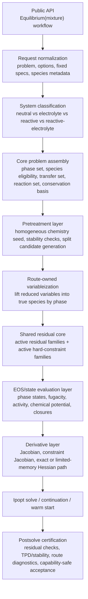
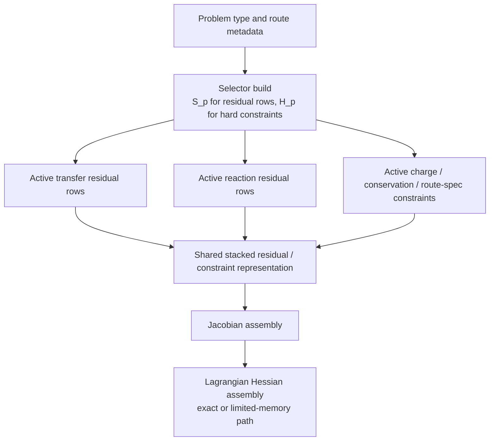
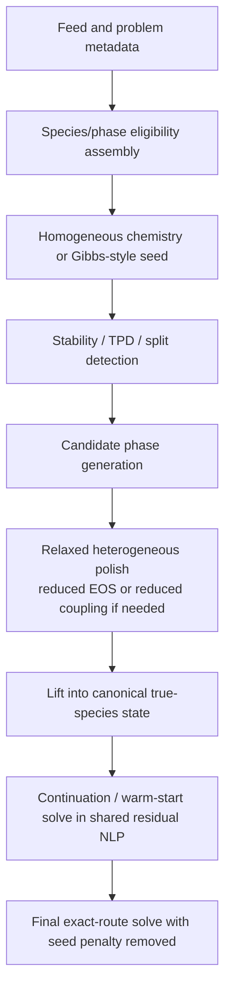
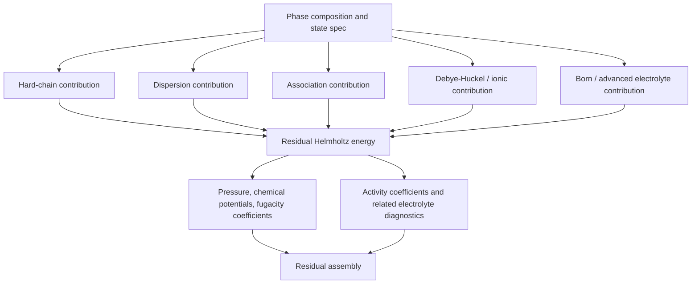

# Unified Equilibrium Core Algorithm

This document is the architecture source of truth for the shared equilibrium core in `ePC-SAFT`.

It is intentionally an architecture contract, not an implementation receipt. The purpose is to define one coherent mathematical and algorithmic structure that can cover:

- homogeneous speciation and chemical equilibrium,
- neutral VLE/LLE/flash routes,
- electrolyte LLE,
- reactive electrolyte LLE,
- later bubble/dew and related phase-equilibrium routes,
- shared pretreatment, stability, continuation, diagnostics, and certification.

The target is a single equilibrium core with route-owned variableizations and selectors, not a family of disconnected solvers or compatibility modes.

## Cleanup contract

The active package architecture is:

- the public `Equilibrium(mixture)` workflow object normalizes supported requests into one route contract;
- Ipopt route callbacks use explicit density or phase volume variables, while pressure-root density solves are limited to normal `State(T, P, x)` calls and seed construction;
- exact gradients and exact Jacobians are required for production routes, with exact Lagrangian Hessians as the default when a route is exposed as production native Ipopt;
- `limited-memory` Hessians are an explicit opt-out mode, not an automatic fallback from `auto`;
- route implementations declare variables, residual families, constraints, phase eligibility, and seed recipes, while shared modules own phase-state adapters, derivative carriers, Lagrangian assembly, Ipopt metadata, diagnostics, and result normalization;
- native route contract payloads should expose their active `variable_model`, `density_backend`, `residual_families`, and `constraint_families` directly rather than leaving that evidence implicit in ad hoc diagnostics strings;
- completed GoalBuddy boards, tranche handoffs, and audit reports are not source-of-truth package documentation once their current facts are captured here or in `FULL_ROADMAP.md`.

## Governing decisions

The core decisions fixed by this document are:

1. The final package equilibrium representation is an explicit residual-based nonlinear program, not a direct all-purpose Gibbs minimizer.
2. Gibbs-style minimization remains useful as a soft-start, feasibility, and globalization layer.
3. Canonical thermodynamic truth is true species by phase.
4. Reduced, transformed, apparent, or reaction-coordinate variables are allowed only as route-owned variableizations that lift into the canonical truth.
5. Pretreatment, stability testing, seed generation, and certification are shared infrastructure for all equilibrium families.
6. The core must support two first-class interphase equilibrium mechanisms in the same simultaneous problem:
   - direct transfer of the same species across phases,
   - cross-phase reaction equilibrium for extraction and complexation systems.
7. Phase-restricted species are first-class generic-core data, not route-specific hacks.
8. Exact gradients and exact Jacobians are required for production routes. Exact Lagrangian Hessians are the target whenever the active route has full derivative coverage.

## Priority alignment

The intended priority order is:

- Tier 1:
  - electrolyte LLE,
  - reactive electrolyte LLE,
  - speciation / chemical equilibrium with EOS activities.
- Tier 2:
  - generic VLE and TP flash,
  - neutral LLE.
- Tier 3:
  - electrolyte bubble and other less central routes,
  - VLLE and other secondary multiphase routes.

The architecture must still be general enough that Tier 2 and Tier 3 routes are reduced views of the same core rather than separate solver families.

## Current public entrypoint and selector boundary

The current repo exposes selector-backed neutral VLE production routes through
the direct workflow object. The selector core sits beneath this interface:

- `Equilibrium(mixture)`
- `Equilibrium(mixture).solve(route="bubble_pressure", T=..., x=...)`
- `Equilibrium(mixture).solve(route="bubble_temperature", P=..., x=...)`
- `Equilibrium(mixture).solve(route="dew_pressure", T=..., y=...)`
- `Equilibrium(mixture).solve(route="dew_temperature", P=..., y=...)`
- `Equilibrium(mixture).solve(route="flash", T=..., P=..., z=...)`

The native activation matrix is authoritative for route-family exposure.
`bubble_dew_derived_routes` and `neutral_tp_flash` are production exposed for
neutral, non-reactive, non-electrolyte, non-associating mixtures. LLE,
electrolyte, reactive, and speciation families remain declared-not-exposed
future families and must not be advertised as callable public routes until a
selector-owned production implementation and focused public tests exist.

The architecture below should therefore be read as a unifying backend contract
for future route families, not as a claim that those families are presently
available.

## Architecture preflight gate for route additions

Every equilibrium route addition must pass this gate before implementation
edits begin:

1. Prove the owner file for the closest production route. For neutral VLE, the
   owner is `src/epcsaft/native/equilibrium/routes/derived/bubble_dew.cpp`,
   reached through `src/epcsaft/native/equilibrium/core/selector_core.cpp`.
   New neutral VLE specs extend that core; they do not create a sibling
   production route family.
2. Write the route-spec matrix: route, knowns, unknowns, composition role,
   active residual rows, hard constraints, certification rows, activation key,
   and public entrypoint.
3. Add negative tests before implementation for direct pybind route exposure,
   Python dispatch around the selector, standalone flash/bubble/dew routes, and
   optimizer success without residual/certification acceptance.
4. Treat activation metadata as admission control. An activation key declares
   residual and constraint topology that the selector may expose after proof; it
   is not permission to invent an independent public route.
5. Get route-owner review before design lock when there are multiple plausible
   implementation paths.

If the owner file or route-spec matrix is ambiguous, stop and ask for
clarification before writing production code.

### Current neutral VLE route-spec matrix

| Public route spec | Selector route | Knowns | Unknowns | Composition role | Activation key | Residual rows | Hard constraints | Certification |
| --- | --- | --- | --- | --- | --- | --- | --- | --- |
| `solve(route="bubble_pressure", T, x)` | `bubble_pressure` | `T`, liquid `x` | `P`, vapor `y`, phase volumes | liquid | `bubble_dew_derived_routes` | fixed-composition, phase-pressure consistency, phase-equilibrium, phase-distance | fixed liquid composition, common pressure, phase volume gap | exact derivatives, density closure, fixed composition, material/phase totals, phase-equilibrium residual, noncollapsed split |
| `solve(route="bubble_temperature", P, x)` | `bubble_temperature` | `P`, liquid `x` | `T`, vapor `y`, phase volumes | liquid | `bubble_dew_derived_routes` | fixed-composition, phase-pressure consistency, phase-equilibrium, phase-distance | fixed liquid composition, common pressure, phase volume gap | exact derivatives, density closure, fixed composition, material/phase totals, phase-equilibrium residual, noncollapsed split |
| `solve(route="dew_pressure", T, y)` | `dew_pressure` | `T`, vapor `y` | `P`, liquid `x`, phase volumes | vapor | `bubble_dew_derived_routes` | fixed-composition, phase-pressure consistency, phase-equilibrium, phase-distance | fixed vapor composition, common pressure, phase volume gap | exact derivatives, density closure, fixed composition, material/phase totals, phase-equilibrium residual, noncollapsed split |
| `solve(route="dew_temperature", P, y)` | `dew_temperature` | `P`, vapor `y` | `T`, liquid `x`, phase volumes | vapor | `bubble_dew_derived_routes` | fixed-composition, phase-pressure consistency, phase-equilibrium, phase-distance | fixed vapor composition, common pressure, phase volume gap | exact derivatives, density closure, fixed composition, material/phase totals, phase-equilibrium residual, noncollapsed split |
| `solve(route="flash", T, P, z)` | `neutral_tp_flash` | `T`, `P`, feed `z` | liquid `x`, vapor `y`, phase amounts, phase volumes | feed | `neutral_tp_flash` | material-balance, phase-pressure consistency, phase-equilibrium, phase-distance | material balance, common pressure, phase volume gap | exact derivatives, density closure, material closure, phase-equilibrium residual, noncollapsed two-phase split |

## End-to-end stack



## Shared sets, maps, and notation

Let:

- $\mathcal{A}$ be the active phase set.
- $\mathcal{I}$ be the global true-species set.
- $\mathcal{R}$ be the active reaction set.
- $\mathcal{B}$ be the conserved-basis rows.
- $\mathcal{T}$ be the transferable same-species interphase pairs.

Define the phase-eligibility mask

$$
M_{i\alpha} \in \{0,1\}, \qquad i \in \mathcal{I},\ \alpha \in \mathcal{A}
$$

with:

- $M_{i\alpha}=1$ if species $i$ is allowed in phase $\alpha$,
- $M_{i\alpha}=0$ if species $i$ is phase-restricted out of phase $\alpha$.

Examples:

- free aqueous ions in a hydrophobic organic phase: typically $M_{i,\mathrm{org}}=0$,
- extracted organic complexes such as `RLi` or `Li-TOP-[Tf2N]`: typically $M_{i,\mathrm{aq}}=0$,
- water or neutral cosolvents: often allowed in both phases.

Define the canonical true-species phase-mole tensor

$$
N = \{n_{i\alpha}\}_{i \in \mathcal{I},\ \alpha \in \mathcal{A}}
$$

as the canonical truth state.

The optimizer does not have to use $N$ directly. Each route may own a reduced variable vector $u$ and a lift map

$$
N = \mathcal{T}_{p}(u)
$$

where $p$ denotes the route family or problem type.

This is the core abstraction:

- canonical truth is always true species by phase,
- route efficiency comes from the lift map $\mathcal{T}_{p}$.

## Shared equilibrium mechanisms

The core must support both of the following in the same simultaneous problem.

### 1. Direct transfer residuals

For species that exist in both phases and really are the same chemical species, equilibrium is enforced by direct chemical-potential equality:

$$
r_{i,\alpha\beta}^{\mathrm{tr}} = \mu_{i}^{(\alpha)} - \mu_{i}^{(\beta)} = 0
$$

Equivalent forms are:

$$
\ln f_{i}^{(\alpha)} - \ln f_{i}^{(\beta)} = 0
$$

or

$$
\ln a_{i}^{(\alpha)} - \ln a_{i}^{(\beta)} = 0
$$

when those are the more natural state functions for the route.

### 2. Cross-phase reaction residuals

For extraction, complexation, or other cases where species identity changes across phases, equilibrium is enforced by reaction affinity:

$$
r_{\ell}^{\mathrm{rxn}} = \frac{1}{RT}\sum_{\alpha \in \mathcal{A}} \sum_{i \in \mathcal{I}} \nu_{\alpha i \ell} \mu_{i}^{(\alpha)} = 0
$$

which is equivalent to

$$
r_{\ell}^{\mathrm{rxn}} = \ln Q_{\ell} - \ln K_{\ell} = 0
$$

for reaction $\ell \in \mathcal{R}$.

This is essential for lithium-extraction systems where free aqueous ions and extracted organic complexes are not identical species.

## Shared hard-constraint families

The final equilibrium core should treat the following as hard constraints or structural lift constraints.

### Conservation

Use a generic conserved-basis matrix $A_{\mathrm{cons}}$:

$$
c^{\mathrm{cons}}(N) = A_{\mathrm{cons}} \operatorname{vec}(N) - b = 0
$$

where:

- for nonreactive routes, $A_{\mathrm{cons}}$ may reduce to species balances,
- for reactive routes, $A_{\mathrm{cons}}$ should be an element or conserved-moiety basis.

### Phase electroneutrality

For electrolyte phases:

$$
c_{\alpha}^{\mathrm{charge}}(N) = \sum_{i \in \mathcal{I}} z_i n_{i\alpha} = 0
$$

for each electrolyte phase $\alpha$.

### Route specifications

These are route-owned equality constraints such as:

- fixed $T$,
- fixed $P$,
- bubble or dew scalar closure,
- split-fraction closure,
- stability trial normalization.

Abstractly:

$$
c^{\mathrm{spec}}_p(u; T, P, z, \ldots) = 0
$$

### EOS and auxiliary closures

Each phase state may require auxiliary closure variables such as density, site fractions, dielectric state, or other hidden EOS state variables:

$$
q_{\alpha} = [\rho_{\alpha}, \theta_{\alpha}, \epsilon_{r,\alpha}, \ldots]
$$

with closure equations

$$
c_{\alpha}^{\mathrm{eos}}(q_{\alpha}, n_{\alpha}, T, P) = 0
$$

These are part of the mathematical problem even if the route chooses to eliminate them by implicit solves.

### Phase eligibility and positivity

Whenever possible, phase restrictions should be enforced structurally through the route lift map and bounds:

$$
n_{i\alpha} = 0 \quad \text{if } M_{i\alpha}=0
$$

and

$$
n_{i\alpha} \ge 0 \quad \text{if } M_{i\alpha}=1
$$

This is preferred over soft penalties.

## Residual-family selector architecture

The route does not change the core equations. It changes which residual families and which hard-constraint families are active.

Let $\bar r(u)$ be the master equilibrium-residual stack and $\bar c(u)$ be the master hard-constraint stack. Let $S_p$ and $H_p$ be selector matrices or masks for problem type $p$:

$$
r_p(u) = S_p \bar r(u), \qquad c_p(u) = H_p \bar c(u)
$$

This is the formal mechanism for the "on/off flags" required by the design.

The selector is allowed to activate or deactivate:

- direct transfer rows,
- reaction rows,
- phase-charge rows,
- route-spec rows,
- split-specific rows,
- stability-trial rows,
- route-specific certification rows.



## Problem-family activation matrix

| Problem family | Direct transfer | Reaction equilibrium | Conservation basis | Phase charge | Split variables | Stability prelayer | Postsolve certification |
| --- | --- | --- | --- | --- | --- | --- | --- |
| Neutral TP flash | On | Off | Species | Off | On | On | On |
| Neutral LLE | On | Off | Species | Off | On | On | On |
| Electrolyte LLE | On for transferable species | Off unless chemistry is modeled | Species or salt/solvent lift with exact back-lift | On | On | On | On |
| Reactive speciation | Off | On | Element/moiety | On when ionic | Off | Optional | On |
| Reactive LLE | On for shared species | On | Element/moiety | Optional | On | On | On |
| Reactive electrolyte LLE | On for shared species | On, including cross-phase reactions | Element/moiety | On | On | On | On |
| Bubble/dew derived routes | On | Off unless reactive route is explicitly modeled | Species or element/moiety | Optional | Usually one phase amount removed by spec | On | On |

Notes:

- Long-term Tier 1 emphasis remains electrolyte LLE, reactive electrolyte LLE, and reactive speciation.
- Current production exposure is intentionally neutral VLE only: selector-dispatched
  bubble/dew pressure and temperature routes plus selector-dispatched two-phase
  TP flash are active.
- Native C++ activation metadata is owned by `src/epcsaft/native/equilibrium/core/activation_matrix.h`.
  The metadata declares all problem families, keeps unproven families declared-not-exposed, and marks only the trusted
  neutral VLE hydrocarbon Ipopt exact-Hessian routes as production-exposed. CMake owns native implementation through
  explicit source groups under `native/model`, `native/eos`, `native/autodiff`, `native/equilibrium`,
  `native/regression`, and `native/bindings`.

## Canonical optimization form

The final package representation is a residual-based constrained NLP:

$$
\min_{u} \ \Phi_p(u)
$$

subject to

$$
c_p(u) = 0
$$

and

$$
\ell_p \le u \le u_p
$$

with objective

$$
\Phi_p(u)
= \frac{1}{2}\left\|W_{r,p}\, r_p(u)\right\|_2^2 +
\frac{\eta_{\mathrm{seed}}}{2}\left\|W_s \left(u-u^{(0)}\right)\right\|_2^2
$$

where:

- $r_p(u)$ is the active equilibrium-residual stack,
- $W_{r,p}$ is a route-specific residual-weight matrix,
- $u^{(0)}$ is the current seed or continuation point,
- $\eta_{\mathrm{seed}} \ge 0$ is a globalization weight.

The first term is the shared "equilibrium objective" built from:

- direct transfer residuals,
- reaction residuals,
- or both, depending on the route.

The seed-regularization term is only for globalization, continuation, or early-stage polishing. In the final certification solve it should be disabled:

$$
\eta_{\mathrm{seed}} = 0
$$

This keeps the final accepted solution tied to the real equilibrium residuals rather than to seed proximity.

## Why this form is preferred

This form is preferred because it:

- keeps the physical pass/fail conditions explicit,
- makes residual activation by problem type clean,
- supports exact Jacobians and exact Lagrangian Hessians,
- preserves route-owned variableizations,
- allows Gibbs-style or relaxed seeds without changing the final truth conditions,
- gives route diagnostics in physically interpretable blocks.

## Soft-start and globalization ladder

The final core is not expected to converge robustly from arbitrary seeds. Shared pretreatment is therefore a first-class part of the design.



The shared seed ladder should support:

- homogeneous chemistry soft starts,
- one-phase-to-two-phase split generation,
- route-owned transformed-coordinate seeds,
- warm starts across temperature, pressure, composition, or continuation steps,
- optional relaxed heterogeneous solves that preserve chemistry truth while simplifying numerics.

## Stability as shared infrastructure

Stability is not a special add-on only for VLE.

It is shared infrastructure for:

- deciding whether a split is needed,
- generating candidate daughter phases,
- rejecting metastable or false splits,
- protecting the final route against bad seeds,
- certifying accepted results.

The stability sublayer may use reduced trial-phase problems, but it must still consume the same EOS/state and derivative infrastructure as the main core.

## EOS/state evaluation contract

Every route ultimately depends on phase-state evaluations of the form:

$$
s_{\alpha} = \mathcal{E}_{\alpha}(T, P, n_{\alpha})
$$

where the phase-state payload must be rich enough to provide, at minimum:

- $a_{\alpha}^{\mathrm{res}}$,
- $P_{\alpha}$ or the pressure residual,
- $\mu_{i}^{(\alpha)}$,
- $\ln \phi_{i}^{(\alpha)}$,
- $\ln \gamma_{i}^{(\alpha)}$ when defined for the route,
- density closure information,
- dielectric and association auxiliaries where relevant.

The EOS contribution graph is:



## Required derivative tiers

Exact Hessians for the shared core require more than "objective Hessians" in isolation. They require the derivative stack all the way from EOS closures to the Hessian of the Lagrangian.

### Tier 0: value layer

Return values only:

- $a^{\mathrm{res}}$,
- $P$,
- $\mu_i$,
- $\ln \phi_i$,
- $\ln \gamma_i$,
- density/closure residuals.

### Tier 1: explicit first derivatives

Return exact first derivatives of the value layer with respect to the route variables or lifted phase-state variables.

Typical examples:

- $\partial \mu_i / \partial n_j$,
- $\partial \ln \phi_i / \partial n_j$,
- $\partial P / \partial \rho$,
- $\partial a^{\mathrm{res}} / \partial \rho$.

### Tier 2: implicit closure sensitivities

If the EOS state uses hidden closure variables $q_{\alpha}$, they must expose exact first-order sensitivities via the implicit function theorem:

$$
\frac{\partial q_{\alpha}}{\partial u}
= -
\left(
\frac{\partial c_{\alpha}^{\mathrm{eos}}}{\partial q_{\alpha}}
\right)^{-1}
\frac{\partial c_{\alpha}^{\mathrm{eos}}}{\partial u}
$$

This is required for exact route Jacobians whenever density, association, dielectric, or other hidden closures move with the route variables.

### Tier 3: exact residual Hessians

Exact Hessian mode requires second derivatives of active residual and active hard-constraint blocks after all lift maps and implicit closures are accounted for.

This may be supplied by:

- analytic second derivatives,
- CppAD differentiated residual assembly,
- analytic implicit-differentiation blocks,
- or mixed analytic plus CppAD plus implicit-differentiation paths.

The key requirement is route completeness, not a single derivation style.

## Jacobian and Hessian structure

The route Jacobians are:

$$
J_r(u) = \frac{\partial r_p}{\partial u},
\qquad
J_c(u) = \frac{\partial c_p}{\partial u}
$$

with the chain rule passing through:

- route variableization $u \mapsto N$,
- EOS hidden-state closure $N \mapsto q$,
- thermodynamic properties $(N,q) \mapsto \mu, \phi, \gamma, \ldots$,
- residual assembly.

The Lagrangian is:

$$
\mathcal{L}(u,\lambda,z_L,z_U)
= \Phi_p(u) + \lambda^{\top} c_p(u) + z_L^{\top}(u-\ell_p) + z_U^{\top}(u-u_p)
$$

For exact Hessian mode:

$$
\nabla_{uu}^{2}\mathcal{L}
= J_r^{\top} W_{r,p}^{\top} W_{r,p} J_r +
\sum_{k} \omega_k r_k \nabla_{uu}^{2} r_k +
\sum_{j} \lambda_j \nabla_{uu}^{2} c_j +
\eta_{\mathrm{seed}} W_s^{\top} W_s
$$

Interpretation:

- the first term is the Gauss-Newton block,
- the second term is residual-curvature correction,
- the third term is the hard-constraint curvature contribution,
- the fourth term is optional seed regularization.

This is why exact Hessians for the shared equilibrium core require the full derivative tier rather than isolated objective-Hessian support.

## Hessian modes

The equilibrium core should preserve three user-facing Hessian modes:

- `hessian_mode="exact"`
- `hessian_mode="limited-memory"`
- `hessian_mode="auto"`

Required behavior:

- `exact` must fail loudly if any active route block lacks second-derivative coverage.
- `limited-memory` may still require exact gradients and exact Jacobians.
- `auto` must select `exact` for production native Ipopt routes. If an active route lacks verified complete Hessian coverage, that is an implementation gap and the route must fail loudly rather than silently selecting a non-exact Hessian mode.

Every solve should report:

- `hessian_approximation`,
- `hessian_backend`,
- and enough route diagnostics to show which derivative tier was active.

## Route-owned variableizations

The shared core must not force one global public variableization.

Instead:

- canonical truth is true species by phase,
- public API remains problem-family oriented,
- each route may choose a numerically convenient variableization,
- every variableization must lift cleanly into the same canonical truth.

Examples:

- neutral flash: phase fractions plus phase compositions,
- electrolyte LLE: transformed salt/solvent basis that preserves electroneutrality while lifting back to true species,
- reactive speciation: reduced reaction or conserved-basis coordinates lifted into true species,
- reactive electrolyte LLE: route-owned transformed variables for initialization, but final truth still expressed in explicit true species by phase.

## Certification requirements

A solve is not accepted merely because the optimizer reports convergence.

Postsolve certification must check:

### Active equilibrium residuals

$$
\delta_{\mathrm{tr}} = \|r^{\mathrm{tr}}\|_{\infty},
\qquad
\delta_{\mathrm{rxn}} = \|r^{\mathrm{rxn}}\|_{\infty}
$$

### Hard constraints

$$
\delta_{\mathrm{cons}} = \|c^{\mathrm{cons}}\|_{\infty},
\qquad
\delta_{\mathrm{charge}} = \|c^{\mathrm{charge}}\|_{\infty},
\qquad
\delta_{\mathrm{spec}} = \|c^{\mathrm{spec}}\|_{\infty}
$$

### Stability

Single-phase or final accepted phase states must pass the appropriate stability certificate, for example via a TPD-style criterion:

$$
\Delta g_{\min}^{\mathrm{TPD}} \ge -\tau_{\mathrm{TPD}}
$$

for a certified stable state, or a route-specific equivalent certification rule for accepted multiphase states.

### Physical admissibility

Check:

- positivity,
- phase restrictions,
- acceptable density closure,
- acceptable hidden-state closure,
- no silently activated fallback route that changes the thermodynamic meaning.

## Pseudocode skeleton

```text
Equilibrium(mixture).solve(problem):
    normalize problem and options
    classify route family
    build phase set, species set, eligibility mask, reaction set, transferable set
    build conserved-basis operator
    generate seed with shared pretreatment ladder
    choose route-owned variableization and lift map
    assemble active residual selectors and hard-constraint selectors
    solve shared residual NLP with continuation / warm start support
    if exact hessian requested:
        require complete second-derivative coverage
    certify residuals, constraints, and stability
    return structured result + diagnostics + continuation state
```

## What this document means for implementation planning

Any future implementation plan should preserve the following boundaries:

1. Do not build separate solver truth systems for electrolyte LLE, reactive electrolyte LLE, and speciation.
2. Do not treat Gibbs soft starts as a replacement for the final simultaneous residual core.
3. Do not hide phase restrictions or cross-phase reactions in route-specific ad hoc logic if they belong in the generic core contract.
4. Do not mark exact-Hessian support complete until the route provides the full derivative tier needed by the Lagrangian Hessian.
5. Do not let bubble/dew or other Tier 3 routes distort the Tier 1 design target.
6. Do not use pytest to validate whole papers or force many literature feed lines to converge. Pytest should prove generic API-to-native route wiring, exact derivative availability, diagnostics, and certification on trusted representative cases; full paper validation belongs in explicit analysis or benchmark scripts.

## Practical source links

This architecture is meant to align with the current repo vocabulary and current package direction documented in:

- `docs/pages/equilibrium_architecture.rst`
- `docs/roadmaps/FULL_ROADMAP.md`
- `docs/papers/md/convex_chemical_equilibrium.md`
- `docs/papers/md/Ascani - 2023 - Simultaneous Predictions of Chemical and Phase Equilibria in Systems with an Esterif.md`
- `docs/papers/md/Yu - 2024 - Highly efficient lithium extraction from magnesium-rich brines with ionic.md`
- `docs/papers/md/Rezaee et al. - 2026 - Thermodynamic modeling of lithium extraction from synthetic brine using deep eutectic solvents A PC.md`

## Summary

The intended final package architecture is:

- one shared equilibrium core,
- one shared residual-based constrained NLP representation,
- one shared derivative ladder from EOS values to exact Lagrangian Hessians,
- one shared pretreatment and certification layer,
- route-owned variableizations that all lift into the same true-species-by-phase state,
- problem-type selectors that turn residual and constraint families on and off without changing the underlying thermodynamic truth.
